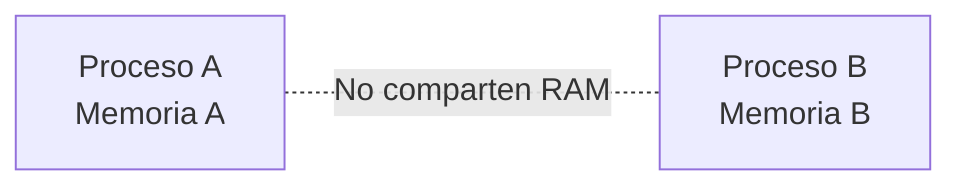
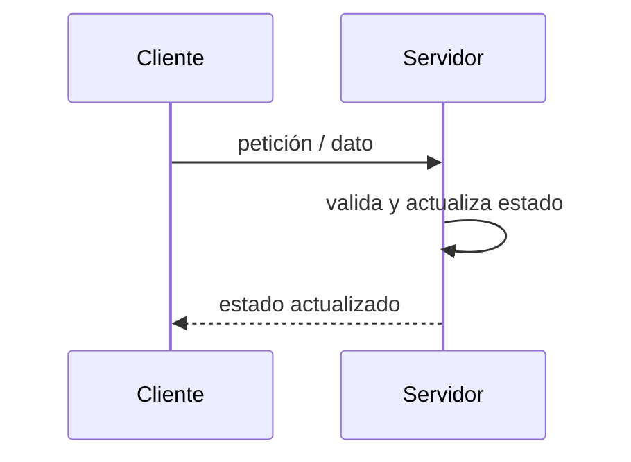
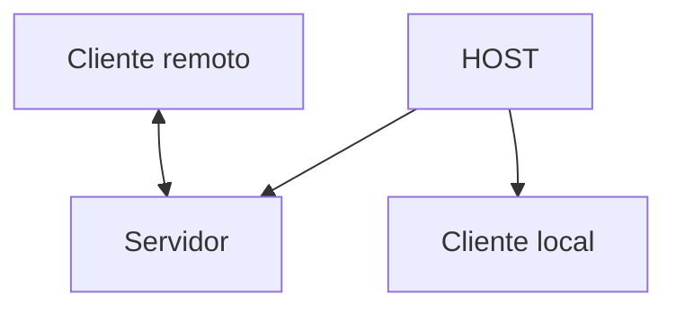
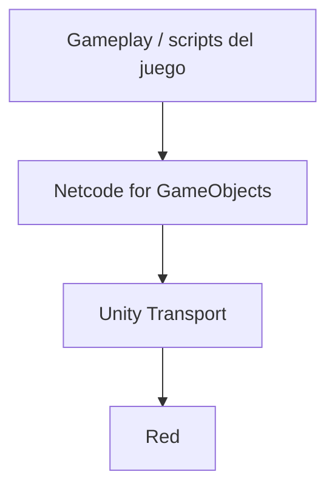
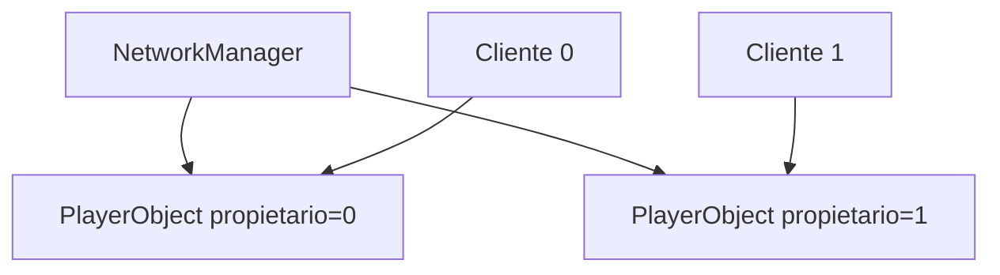
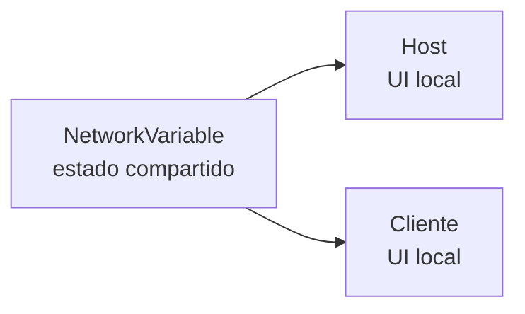
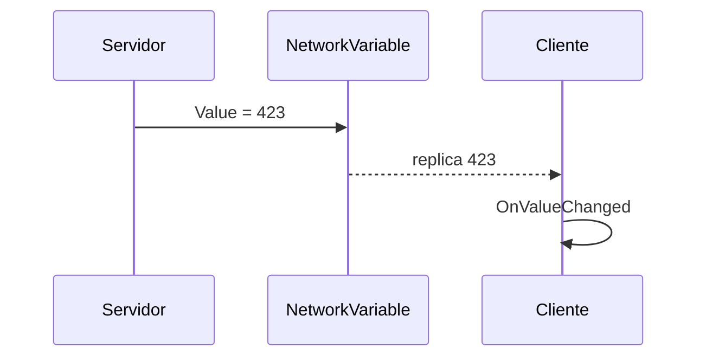
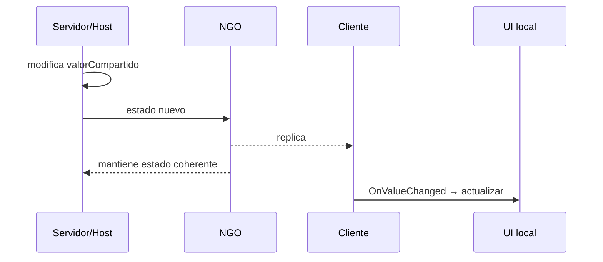

## Apuntes de referencia

**Módulo:** Programación en red e Inteligencia Artificial  
**Curso de Especialización:** Desarrollo de Videojuegos y Realidad Virtual  
**Proyecto de la UT:** Basic NGO 
**Tecnología:** Unity + C# + Netcode for GameObjects (NGO)


---


## Bloque I — Introducción

Este bloque presenta el propósito de la unidad, los aprendizajes esperados, su relación con el Resultado de Aprendizaje, el producto de trabajo y la idea fundamental sobre la que se apoya todo el multijugador: cada instancia ejecuta su propia copia del juego.

### 1. Propósito

En un juego local resulta natural escribir:

```csharp
puntuacion = puntuacion + 1;
```

y esperar que «el juego» tenga ahora una puntuación nueva.

En multijugador aparece un problema fundamental: **no existe una única copia del juego**. Hay varios procesos, normalmente en equipos diferentes, y cada proceso dispone de su propia memoria.

Si dos jugadores ejecutan el mismo videojuego:

- el jugador A tiene su copia de `puntuacion`;
- el jugador B tiene otra copia;
- cambiar una variable en A **no cambia** automáticamente la variable de B.

Por tanto, desarrollar multijugador no consiste simplemente en «añadir Internet». Hay que diseñar:

1. qué procesos participan;
2. qué información debe compartirse;
3. quién puede modificarla;
4. cómo se transmite;
5. cómo reacciona cada instancia cuando recibe un cambio;
6. cómo se prueba y depura el sistema.

En esta UT construirás un microproyecto sin gameplay complejo para poder observar ese flujo con claridad.

---

### 2. Qué vas a ser capaz de hacer

Al terminar la UT podrás:

- diferenciar **cliente**, **servidor**, **Host** y **servidor dedicado**;
- explicar qué significa **servidor autoritativo**;
- distinguir **authority** de **ownership** a un nivel inicial;
- configurar `NetworkManager` y `UnityTransport`;
- ejecutar un Host y un cliente en procesos separados;
- utilizar `NetworkObject` y `NetworkBehaviour`;
- entender qué es un PlayerObject;
- utilizar `OnNetworkSpawn()` y `OnNetworkDespawn()`;
- identificar el objeto propiedad del cliente local con `IsOwner`;
- sincronizar estado persistente mediante `NetworkVariable`;
- reaccionar a cambios mediante `OnValueChanged`;
- interpretar callbacks y logs de conexión;
- diagnosticar errores básicos de configuración.

---

### 3. Resultado de Aprendizaje relacionado

#### RA1

**Desarrolla videojuegos multijugador identificando y relacionando los fundamentos de programación en red cliente-servidor.**

En esta UT se trabajará especialmente la capacidad de:

- controlar el estado de red con un administrador;
- configurar una partida alojada por un cliente que actúa como Host;
- comprender el intercambio de información;
- diseñar el papel del cliente y del servidor.

También comenzarás a trabajar elementos del RA2:

- objetos de red;
- comportamientos de red;
- variables sincronizadas;
- componentes de networking en Unity.

El objetivo es poder **construir, ejecutar, comprobar y explicar** el sistema.

---

### 4. Producto: Networked Player Cards

El producto será un pequeño laboratorio de red:

- una instancia se inicia como **Host**;
- una segunda instancia se conecta como **Client**;
- cada conexión crea un PlayerObject;
- cada jugador posee una ficha UI;
- la ficha muestra:
  - identificador de cliente;
  - color;
  - dato numérico;
  - marca **YO** en el propietario local;
- el servidor cambia periódicamente el dato;
- NGO replica el estado;
- ambas instancias muestran la misma información;
- si un cliente se desconecta, su ficha desaparece.

No hay puntuación, movimiento ni física. Eso es deliberado: queremos ver la red sin que el gameplay oculte lo importante.

---

### 5. Idea fundamental: varias copias del mismo juego

Supón dos equipos.

#### Equipo A

```text
nombreJugador = "Ana"
puntuacion = 4
```

#### Equipo B

```text
nombreJugador = "Luis"
puntuacion = 7
```

Aunque ambos ejecuten el mismo `.exe`, son **procesos distintos**.



Cambiar:

```csharp
puntuacion = 5;
```

en A no modifica B.

Para que ambos vean un estado común hace falta comunicación.

---


## Bloque II — Fundamentos de programación en red

En este bloque se presentan los conceptos necesarios para comprender cómo se comunican varias instancias de un videojuego y cómo se decide qué información pertenece a cada proceso.

### 6. Cliente y servidor

#### 6.1. Cliente

En un videojuego, un **cliente** suele:

- leer input local;
- dibujar gráficos;
- reproducir audio;
- mostrar UI;
- mantener una copia del estado necesario;
- enviar peticiones o datos;
- recibir actualizaciones.

#### 6.2. Servidor

Un **servidor** suele:

- aceptar conexiones;
- mantener el estado compartido que se considera válido;
- ejecutar reglas que no deben decidir los clientes;
- validar acciones;
- distribuir actualizaciones.

Modelo simplificado:



El servidor no tiene por qué ser una máquina enorme en Internet. En desarrollo puede ejecutarse en tu propio ordenador.

---

### 7. ¿Qué es un Host?

En NGO, cuando trabajamos con una arquitectura client-server, un **Host** ejecuta en un mismo proceso:

- el servidor;
- un cliente local.



Por eso:

> **Host = servidor + cliente local.**

Esto tiene una consecuencia importante al depurar: en el proceso Host puede ejecutarse código de servidor y código de cliente.

No debes interpretar «funciona en Host» como prueba suficiente de que «funciona en un cliente remoto».

---

### 8. Servidor dedicado

Un **servidor dedicado** ejecuta el servidor sin participar como jugador.

Sus responsabilidades se centran en:

- lógica;
- estado;
- comunicación;
- simulación que corresponda.

En esta UT **no construiremos** un servidor dedicado. Solo necesitamos comprender la diferencia conceptual.

---

### 9. Servidor autoritativo

En un modelo autoritativo, el servidor mantiene la versión del estado que se considera verdadera.

Ejemplo:

Un cliente dice:

> «Quiero moverme a X».

No debería equivaler automáticamente a:

> «Mi posición oficial ahora es X».

En un juego real, el servidor puede comprobar:

- si la acción es válida;
- si el jugador puede realizarla;
- si viola reglas;
- si llega en el momento correcto.

En nuestro microproyecto el ejemplo será todavía más sencillo:

> **el servidor escribe el color y el dato de la ficha; los clientes los leen.**

---

### 10. Authority y ownership no son lo mismo

Estos términos aparecen juntos y suelen confundirse.

#### Authority

Responde a preguntas como:

- ¿quién decide el estado válido?;
- ¿dónde se ejecuta una regla?;
- ¿quién puede crear o destruir objetos de red?;
- ¿quién valida una acción?

#### Ownership

Responde a:

- ¿a qué cliente pertenece este `NetworkObject`?;
- ¿es esta representación mi PlayerObject local?;
- ¿debo leer input para este objeto?

En un juego client-server puede ocurrir:

- el **cliente** sea owner de su PlayerObject;
- el **servidor** siga siendo la autoridad sobre parte del estado.

En UT01 utilizaremos `IsOwner` para distinguir:

- mi PlayerObject;
- los PlayerObjects remotos que veo como proxies.

---

### 11. ¿Qué viaja por la red?

La red no transporta «el GameObject completo» como una caja mágica.

Se intercambian datos.

Ejemplos:

- input;
- posición;
- puntuación;
- vida;
- turno;
- identificador;
- color;
- acciones;
- eventos.

Antes de sincronizar algo debes poder responder:

> **¿Qué dato necesita conocer la otra instancia y por qué?**

---

### 12. Paquetes y protocolos: visión práctica

Los datos viajan por la red encapsulados en paquetes.

Para esta UT no necesitas diseñar paquetes manualmente, pero sí comprender el contexto.

#### UDP

UDP prioriza una comunicación ligera y con poco overhead.

En videojuegos de tiempo real es frecuente utilizar UDP como base porque una aplicación puede decidir qué información necesita fiabilidad y cuál puede tolerar pérdidas o retrasos.

#### TCP

TCP proporciona entrega fiable y ordenada como parte del protocolo.

Puede ser adecuado para muchas aplicaciones, pero esperar retransmisiones y orden estricto puede ser inconveniente para determinadas actualizaciones de tiempo real.

##### Lo importante en UT01

No memorices:

> «UDP bueno, TCP malo».

La pregunta profesional es:

> **¿qué propiedades necesita esta comunicación?**

Unity Transport proporciona la capa de transporte que NGO puede utilizar. En esta UT no programaremos sockets UDP directamente.

---

### 13. Latencia, RTT, jitter y pérdida

#### Latencia

Tiempo que tarda la información en viajar.

#### RTT

**Round Trip Time**: tiempo de ida y vuelta.

#### Jitter

Variación de la latencia.

Un paquete puede tardar 40 ms y el siguiente 100 ms.

#### Pérdida

Algunos paquetes no llegan.

En nuestro laboratorio local la latencia real será muy pequeña. Más adelante introduciremos condiciones degradadas para observar su efecto en un juego.

---

### 14. Frame rate, tick rate y update rate

No son sinónimos.

#### Frame rate

Frecuencia con la que el juego produce frames visuales.

Ejemplo:

```text
60 FPS
```

#### Tick rate

Frecuencia a la que una simulación de red/servidor actualiza estado según su diseño.

#### Update rate

Frecuencia con la que se intercambian o actualizan determinados datos de red, según el sistema.

En un multijugador no debes asumir:

```text
1 frame = 1 mensaje de red
```

La sincronización debe responder a necesidades de gameplay y coste de red.

---


## Bloque III — Primer entorno multijugador con NGO

En este bloque se trasladan los conceptos anteriores a Unity mediante Netcode for GameObjects. Se prepara el entorno, se inicia una sesión Host/Client y se comprueba el estado de la red.

### 15. Netcode for GameObjects

**Netcode for GameObjects (NGO)** es el framework de alto nivel que utilizaremos para networking en proyectos basados en GameObjects y MonoBehaviours.

NGO se apoya en un transporte. En nuestro caso:

**Unity Transport (UTP)**.

Arquitectura simplificada:



No necesitamos manipular directamente la capa baja para realizar las primeras prácticas.

---

### 16. `NetworkManager`

`NetworkManager` es el punto central de configuración de NGO en un proyecto sencillo.

Gestiona aspectos como:

- iniciar servidor/Host/cliente;
- configuración de transporte;
- Player Prefab;
- objetos/prefabs de red;
- conexión;
- desconexión;
- estado de networking.

En el laboratorio tendremos un GameObject:

```text
NetworkManager
├── NetworkManager
└── UnityTransport
```

---

### 17. Preparación del proyecto

#### 17.1. Versión

Utiliza la versión de Unity indicada para esta unidad.

Mantén durante toda la unidad la misma versión del Editor y de los paquetes. Mezclar versiones puede producir errores difíciles de diagnosticar.

#### 17.2. Paquetes

El proyecto debe contener las versiones fijadas para:

- Netcode for GameObjects;
- Unity Transport;
- Multiplayer Play Mode.

#### 17.3. Estructura

```text
Assets/
├── Escenas/
├── Prefabs/
├── Scripts/
│   ├── Red/
│   └── Interfaz/
└── Documentacion/
```

Mantener la estructura ayuda a leer y depurar el proyecto.

---

### 18. Escena inicial

La escena se llama:

```text
UT01_FundamentosNGO
```

Debe contener:

- `NetworkManager`;
- Canvas de UI;
- panel de conexión;
- lista de jugadores.

En la UI habrá:

- botón Host;
- botón Client;
- botón Apagar;
- texto de estado;
- contenedor de fichas.

---

### 19. Multiplayer Play Mode

Probar multijugador exige al menos dos procesos.

**Multiplayer Play Mode (MPPM)** permite ejecutar varias instancias de desarrollo desde un mismo proyecto, evitando construir un ejecutable en cada pequeño cambio.

Objetivo mínimo:

- proceso principal: Host;
- Virtual Player: Client.

Cuando trabajes:

1. comprueba que el Virtual Player está activo;
2. inicia Play;
3. inicia Host en una instancia;
4. inicia Cliente en la otra;
5. no confundas las Consoles;
6. identifica qué ventana corresponde a qué rol.

---

### 20. Interfaz de inicio de red

Crearemos un script pequeño que permita:

- iniciar Host;
- iniciar Client;
- apagar networking;
- mostrar el rol local;
- registrar conexiones/desconexiones.

Ruta lógica:

```text
Assets/Scripts/Red/LanzadorRedUI.cs
```

Clase base:

```text
MonoBehaviour
```

Dependencias:

- `Unity.Netcode`;
- `UnityEngine.UI`;
- TextMeshPro;
- un `NetworkManager` en escena.

Ejemplo completo del laboratorio:

```csharp
using TMPro;
using Unity.Netcode;
using UnityEngine;
using UnityEngine.UI;

public class LanzadorRedUI : MonoBehaviour
{
    [SerializeField] private Button botonHost;
    [SerializeField] private Button botonCliente;
    [SerializeField] private Button botonApagar;
    [SerializeField] private TMP_Text textoEstado;

    private NetworkManager gestorRed;

    private void Start()
    {
        gestorRed = NetworkManager.Singleton;

        botonHost.onClick.AddListener(IniciarHost);
        botonCliente.onClick.AddListener(IniciarCliente);
        botonApagar.onClick.AddListener(ApagarRed);

        gestorRed.OnClientConnectedCallback += AlConectarCliente;
        gestorRed.OnClientDisconnectCallback += AlDesconectarCliente;

        ActualizarEstado();
    }

    private void Update()
    {
        ActualizarEstado();
    }

    private void OnDestroy()
    {
        if (gestorRed == null)
        {
            return;
        }

        gestorRed.OnClientConnectedCallback -= AlConectarCliente;
        gestorRed.OnClientDisconnectCallback -= AlDesconectarCliente;
    }

    private void IniciarHost()
    {
        bool iniciado = gestorRed.StartHost();
        Debug.Log($"[LOCAL] IniciarHost -> {iniciado}");
    }

    private void IniciarCliente()
    {
        bool iniciado = gestorRed.StartClient();
        Debug.Log($"[LOCAL] IniciarCliente -> {iniciado}");
    }

    private void ApagarRed()
    {
        gestorRed.Shutdown();
        Debug.Log("[LOCAL] ApagarRed solicitado");
    }

    private void AlConectarCliente(ulong idCliente)
    {
        Debug.Log(
            $"[RED] Cliente conectado: {idCliente} | " +
            $"Host={gestorRed.IsHost} " +
            $"Servidor={gestorRed.IsServer} " +
            $"Cliente={gestorRed.IsClient}"
        );
    }

    private void AlDesconectarCliente(ulong idCliente)
    {
        Debug.Log($"[RED] Cliente desconectado: {idCliente}");
    }

    private void ActualizarEstado()
    {
        if (gestorRed == null)
        {
            textoEstado.text = "NetworkManager no disponible";
            return;
        }

        if (gestorRed.IsHost)
        {
            textoEstado.text = "HOST (servidor + cliente)";
        }
        else if (gestorRed.IsServer)
        {
            textoEstado.text = "SERVIDOR";
        }
        else if (gestorRed.IsClient)
        {
            textoEstado.text = "CLIENTE";
        }
        else
        {
            textoEstado.text = "OFFLINE";
        }
    }
}
```

#### 20.1. Qué parte es C# normal

- campos `[SerializeField]`;
- métodos;
- interpolación de cadenas;
- listeners de Button;
- `Debug.Log`.

#### 20.2. Qué parte es NGO

- `NetworkManager`;
- `StartHost()`;
- `StartClient()`;
- `Shutdown()`;
- callbacks de conexión;
- `IsHost`;
- `IsServer`;
- `IsClient`.

---

### 21. Comprobar Host y cliente

Antes de seguir, verifica:

#### Host

El texto debe indicar:

```text
HOST (servidor + cliente)
```

En Console debe aparecer un evento de conexión del cliente local del Host.

#### Segundo proceso

Al pulsar Client:

```text
CLIENTE
```

El Host debe registrar una nueva conexión.

Pregunta de comprensión:

> ¿Por qué el Host recibe también eventos de cliente si ya es servidor?

Respuesta conceptual: porque el Host contiene también un cliente local.

---


## Bloque IV — Objetos de red, lifecycle y ownership

Este bloque explica cómo NGO representa objetos compartidos, cómo se ejecuta su ciclo de vida de red y cómo distinguir propiedad, rol y representación local.

### 22. `NetworkObject`

Un GameObject normal no adquiere identidad de red por existir en la escena.

Para que NGO gestione un objeto de red necesita un:

```text
NetworkObject
```

El `NetworkObject` mantiene información relacionada con:

- spawn;
- despawn;
- ownership;
- identificadores de red.

En nuestro proyecto el Player Prefab tendrá un `NetworkObject`.

---

### 23. `NetworkBehaviour`

Un script que necesita propiedades, callbacks o estado específico de NGO deriva de:

```csharp
NetworkBehaviour
```

en vez de limitarse a:

```csharp
MonoBehaviour
```

Ejemplo mínimo:

```csharp
using Unity.Netcode;
using UnityEngine;

public class SondaRed : NetworkBehaviour
{
    public override void OnNetworkSpawn()
    {
        Debug.Log(
            $"Aparición en red | OwnerClientId={OwnerClientId} | " +
            $"IsOwner={IsOwner} | " +
            $"EsServidor={IsServer} | " +
            $"IsClient={IsClient}"
        );
    }
}
```

Añádelo temporalmente a un Player Prefab y compara el log en Host y cliente.

---

### 24. PlayerObject

NGO puede crear un PlayerObject para cada cliente conectado si el Player Prefab está configurado en `NetworkManager`.

Modelo:



Cada proceso ve representaciones de ambos PlayerObjects, pero solo uno pertenece al cliente local.

---

### 25. `IsOwner`

Dentro de un `NetworkBehaviour`:

```csharp
if (IsOwner)
{
    // Este objeto pertenece al cliente local.
}
```

No significa:

```text
soy el servidor
```

Significa:

```text
este NetworkObject está asignado como propiedad del cliente local
```

En el Host, el PlayerObject del Host será propietario local.

En el cliente remoto, su propio PlayerObject será propietario local.

---

### 26. Lifecycle de red

#### `OnNetworkSpawn()`

Se ejecuta cuando el `NetworkBehaviour` pasa a formar parte activa del mundo de red.

Es un lugar adecuado para:

- consultar propiedades de red;
- suscribirse a cambios;
- crear representación UI ligada al objeto;
- realizar inicialización que depende del estado de networking.

#### `OnNetworkDespawn()`

Se ejecuta cuando el objeto deja de estar spawneado en red.

Es un lugar adecuado para:

- desuscribirse de eventos;
- limpiar UI;
- detener actualizaciones;
- liberar estado asociado.

Patrón:

```csharp
public override void OnNetworkSpawn()
{
    // Suscribirse / crear vista / aplicar estado.
}

public override void OnNetworkDespawn()
{
    // Desuscribirse / limpiar vista.
}
```

---

### 27. Por qué no basta `Start()`

`Start()` pertenece al lifecycle general de Unity.

`OnNetworkSpawn()` pertenece al lifecycle de NGO.

Un objeto puede existir como GameObject y todavía no encontrarse en el estado de red que necesitas.

Cuando una inicialización depende de:

- `IsOwner`;
- `IsServer`;
- `OwnerClientId`;
- variables de red;
- estado de spawn;

prefiere pensar primero:

> ¿debo realizarla cuando el objeto entra realmente en la red?

---

### 28. UI local frente a estado de red

La ficha UI **no necesita ser NetworkObject**.

Cada proceso crea su propia ficha.



Si sincronizáramos directamente elementos de UI estaríamos acoplando la red a una representación visual concreta.

Es mejor separar:

```text
estado → evento local → vista
```

---


## Bloque V — Estado sincronizado y UI reactiva

Este bloque conecta el estado de red con la representación local. Se estudia cómo sincronizar información persistente y cómo actualizar la interfaz cuando ese estado cambia.

### 29. `VistaFichaJugador`

Ruta:

```text
Assets/Scripts/Interfaz/VistaFichaJugador.cs
```

Clase base:

```text
MonoBehaviour
```

Responsabilidad:

- mostrar identidad;
- mostrar color;
- mostrar dato;
- mostrar marca de jugador local.

Código:

```csharp
using TMPro;
using UnityEngine;
using UnityEngine.UI;

public class VistaFichaJugador : MonoBehaviour
{
    [SerializeField] private TMP_Text textoIdentidad;
    [SerializeField] private TMP_Text textoDato;
    [SerializeField] private Image muestraColor;
    [SerializeField] private GameObject marcaLocal;

    public void EstablecerIdentidad(ulong idCliente, bool esLocal)
    {
        textoIdentidad.text = $"Cliente {idCliente}";
        marcaLocal.SetActive(esLocal);
    }

    public void EstablecerColor(Color color)
    {
        muestraColor.color = color;
    }

    public void EstablecerDato(int valor)
    {
        textoDato.text = $"Dato: {valor}";
    }
}
```

Este script no sabe cómo funciona NGO.

Eso es una ventaja: la vista solo sabe representar datos.

---

### 30. `VistaListaJugadores`

Ruta:

```text
Assets/Scripts/Interfaz/VistaListaJugadores.cs
```

Responsabilidad:

- conocer el contenedor de fichas;
- conocer el prefab visual;
- crear una ficha local cuando un PlayerObject de red la necesita.

```csharp
using UnityEngine;

public class VistaListaJugadores : MonoBehaviour
{
    public static VistaListaJugadores Instancia { get; private set; }

    [SerializeField] private Transform raizLista;
    [SerializeField] private VistaFichaJugador prefabFicha;

    private void Awake()
    {
        if (Instancia != null && Instancia != this)
        {
            Destroy(gameObject);
            return;
        }

        Instancia = this;
    }

    private void OnDestroy()
    {
        if (Instancia == this)
        {
            Instancia = null;
        }
    }

    public VistaFichaJugador CrearFicha(ulong idCliente, bool esLocal)
    {
        VistaFichaJugador ficha = Instantiate(prefabFicha, raizLista);
        ficha.EstablecerIdentidad(idCliente, esLocal);
        return ficha;
    }
}
```

En un proyecto profesional podríamos evitar un singleton o utilizar inyección de dependencias. En este laboratorio se acepta porque mantiene pequeña la arquitectura.

---

### 31. `NetworkVariable`

Una `NetworkVariable<T>` representa **estado persistente sincronizado**.

Ejemplo:

```csharp
public NetworkVariable<int> valorCompartido = new(0);
```

No es una variable C# ordinaria.

En un modelo client-server, por defecto:

- el servidor puede escribir;
- los clientes pueden leer.

Concepto:



Esto es diferente de un evento puntual. Una nueva conexión puede recibir el valor actual de una `NetworkVariable` porque representa estado.

---

### 32. `OnValueChanged`

Para reaccionar a un cambio:

```csharp
valorCompartido.OnValueChanged += AlCambiarDato;
```

Callback:

```csharp
private void AlCambiarDato(int anterior, int actual)
{
    Debug.Log($"{anterior} -> {actual}");
}
```

Conviene suscribirse durante `OnNetworkSpawn()` y desuscribirse en `OnNetworkDespawn()`:

```csharp
public override void OnNetworkSpawn()
{
    valorCompartido.OnValueChanged += AlCambiarDato;
}

public override void OnNetworkDespawn()
{
    valorCompartido.OnValueChanged -= AlCambiarDato;
}
```

Esto evita dejar listeners vinculados a objetos que ya no están activos en red.

---

### 33. Estado inicial y cambio posterior

Un detalle importante:

No debes depender únicamente de `OnValueChanged` para pintar el primer valor.

Patrón robusto:

1. suscribirse;
2. leer `valorCompartido.Value`;
3. actualizar la vista;
4. reaccionar después a cambios.

Ejemplo:

```csharp
public override void OnNetworkSpawn()
{
    valorCompartido.OnValueChanged += AlCambiarDato;

    vistaFicha.EstablecerDato(valorCompartido.Value);
}
```

Así la UI muestra el estado actual aunque el cambio se hubiera producido antes de que esa vista existiera.

---

### 34. Script de red de la ficha

Ruta:

```text
Assets/Scripts/Red/FichaJugadorRed.cs
```

Clase base:

```text
NetworkBehaviour
```

Componentes requeridos:

- el GameObject/prefab debe tener `NetworkObject`;
- la escena debe tener un `VistaListaJugadores`;
- `NetworkManager` debe utilizar el prefab como Player Prefab.

Código completo de referencia:

```csharp
using Unity.Netcode;
using UnityEngine;

public class FichaJugadorRed : NetworkBehaviour
{
    public NetworkVariable<Color> colorJugador = new(Color.white);
    public NetworkVariable<int> valorCompartido = new(0);

    private VistaFichaJugador vistaFicha;

    public override void OnNetworkSpawn()
    {
        colorJugador.OnValueChanged += AlCambiarColor;
        valorCompartido.OnValueChanged += AlCambiarDato;

        vistaFicha = VistaListaJugadores.Instancia.CrearFicha(
            OwnerClientId,
            IsOwner
        );

        AplicarEstadoActual();

        if (IsServer)
        {
            colorJugador.Value = Random.ColorHSV(
                0f, 1f,
                0.8f, 1f,
                0.9f, 1f
            );

            valorCompartido.Value = Random.Range(100, 1000);

            InvokeRepeating(
                nameof(ActualizarValorServidor),
                1f,
                2f
            );
        }
    }

    public override void OnNetworkDespawn()
    {
        colorJugador.OnValueChanged -= AlCambiarColor;
        valorCompartido.OnValueChanged -= AlCambiarDato;

        if (IsServer)
        {
            CancelInvoke(nameof(ActualizarValorServidor));
        }

        if (vistaFicha != null)
        {
            Destroy(vistaFicha.gameObject);
        }
    }

    private void ActualizarValorServidor()
    {
        if (!IsServer)
        {
            return;
        }

        valorCompartido.Value = Random.Range(100, 1000);
    }

    private void AlCambiarColor(Color anterior, Color actual)
    {
        if (vistaFicha != null)
        {
            vistaFicha.EstablecerColor(actual);
        }
    }

    private void AlCambiarDato(int anterior, int actual)
    {
        if (vistaFicha != null)
        {
            vistaFicha.EstablecerDato(actual);
        }
    }

    private void AplicarEstadoActual()
    {
        if (vistaFicha == null)
        {
            return;
        }

        vistaFicha.EstablecerColor(colorJugador.Value);
        vistaFicha.EstablecerDato(valorCompartido.Value);
    }
}
```

---

### 35. Leer el flujo del script

No memorices el archivo. Sigue el flujo.

#### Al aparecer el PlayerObject

```text
OnNetworkSpawn()
```

1. se suscribe a las NetworkVariables;
2. crea una ficha local;
3. marca si ese PlayerObject es el propietario local;
4. muestra el estado actual;
5. si esta instancia ejecuta servidor:
   - asigna color;
   - asigna valor;
   - programa cambios posteriores.

#### Cuando cambia el dato

Servidor:

```csharp
valorCompartido.Value = ...
```

NGO replica.

Cada instancia:

```text
AlCambiarDato(anterior, actual)
```

actualiza su UI local.

#### Al desaparecer

```text
OnNetworkDespawn()
```

1. desuscribe eventos;
2. detiene la actualización del servidor;
3. destruye la ficha UI local.

---

### 36. Comprobación del funcionamiento

Ejecuta Host + un cliente.

#### En Host

Deberías ver:

- dos fichas cuando el segundo cliente entra;
- una marcada como local/YO;
- un color por jugador;
- el dato actualizándose.

#### En cliente

Deberías ver:

- las mismas dos identidades;
- los mismos colores;
- los mismos datos;
- una marca YO distinta: la del jugador propiedad de ese cliente.

#### Pregunta

Si Host y cliente muestran las mismas fichas:

> ¿significa que comparten el mismo objeto UI?

No.

Cada proceso tiene su propia UI. Lo común es el estado sincronizado.

---

### 37. Variable local frente a `NetworkVariable`

Añade temporalmente:

```csharp
private int contadorLocal;
```

y cámbialo solo en una instancia.

Observa:

- cambia localmente;
- no aparece en la otra instancia.

Después compara con:

```csharp
valorCompartido.Value
```

cuando lo modifica el servidor.

Conclusión:

> Ser el mismo script no significa ser la misma memoria.

---

### 38. Escritura de estado desde el cliente

En un entorno controlado, intenta modificar la `NetworkVariable` desde un cliente que no es servidor.

Pregunta antes de ejecutar:

> ¿debería permitirse?

En nuestro diseño, no.

El servidor es la fuente de verdad.

Si la API rechaza la escritura o genera error/advertencia, no «arregles» el problema dando permisos arbitrariamente. Pregunta primero:

> ¿quién debería poder escribir este estado según el diseño?

---


## Bloque VI — Conexión, desconexión y diagnóstico

Este bloque se centra en el comportamiento del sistema cuando las conexiones cambian y en un método sistemático para localizar errores de configuración, lifecycle y sincronización.

### 39. Conexión y desconexión

`NetworkManager` permite observar cambios de conexión mediante callbacks.

En el launcher utilizamos:

```csharp
gestorRed.OnClientConnectedCallback += AlConectarCliente;
gestorRed.OnClientDisconnectCallback += AlDesconectarCliente;
```

Cuando la escena o el objeto se destruye, retiramos la suscripción.

Esta regla es general:

> Si te suscribes a un evento cuyo emisor puede seguir vivo más tiempo que tu objeto, planifica también cómo desuscribirte.

---

### 40. ¿Qué ocurre al desconectar un PlayerObject?

En nuestro microproyecto esperamos:

1. el servidor detecta la desconexión;
2. el PlayerObject deja de existir en red;
3. en cada cliente se ejecuta el cleanup correspondiente;
4. la ficha UI local desaparece.

Si la ficha se queda visible, no es un problema de «Internet». Probablemente es un problema de lifecycle o limpieza local.

---

### 41. Método de troubleshooting

No depures cambiando cosas al azar.

Utiliza:

```text
síntoma
→ hipótesis
→ prueba
→ observación
→ conclusión
```

Ejemplo:

**Síntoma:** el cliente no muestra ningún PlayerObject.

**Hipótesis:** `NetworkManager` no tiene Player Prefab.

**Prueba:** abrir Inspector y comprobar el campo.

**Observación:** está vacío.

**Conclusión:** el servidor no tiene prefab configurado para crear el PlayerObject.

---

### 42. Fallos típicos

#### 42.1. Cliente no conecta

Comprueba:

1. ¿hay Host o servidor escuchando?;
2. ¿ambos usan el mismo Address?;
3. ¿ambos usan el mismo Port?;
4. ¿UnityTransport está asignado?;
5. ¿hay error en Console?

#### 42.2. PlayerObject no aparece

Comprueba:

- Player Prefab;
- `NetworkObject`;
- prefab correctamente guardado;
- errores de compilación.

#### 42.3. NullReference en UI

Comprueba:

- referencias serializadas;
- `VistaListaJugadores`;
- prefab de ficha;
- orden/activación de objetos de escena.

#### 42.4. Valor solo cambia en Host

Pregunta:

- ¿es `NetworkVariable` o un `int` local?;
- ¿el script deriva de `NetworkBehaviour`?;
- ¿el GameObject tiene `NetworkObject`?;
- ¿está realmente spawneado?;
- ¿estás observando el mismo PlayerObject?

#### 42.5. Ficha permanece después de desconectar

Comprueba:

- `OnNetworkDespawn`;
- desuscripciones;
- destrucción de la vista local.

---


## Bloque VII — Síntesis y consulta

Este bloque reúne los conceptos esenciales de la unidad y ofrece un mapa de consulta rápida de los componentes, propiedades, métodos y elementos utilizados en U01.

La primera tabla permite recordar de un vistazo **qué piezas intervienen**. Después se ofrece una referencia más detallada organizada por categorías.

### 49. Resumen técnico de la unidad

#### Arquitectura

```text
cliente(s) ↔ servidor
Host = servidor + cliente local
```

Cada instancia del videojuego mantiene su propia memoria. El estado que deba ser común debe comunicarse mediante la red.

#### Flujo principal del microproyecto

```text
NetworkManager
→ inicia Host o Client
→ NGO crea un PlayerObject por conexión
→ cada PlayerObject ejecuta un NetworkBehaviour
→ el servidor modifica NetworkVariable
→ NGO replica el estado
→ OnValueChanged avisa a cada instancia
→ la UI local representa el nuevo valor
```

#### Flujo visual



#### Regla de depuración

```text
síntoma
→ hipótesis
→ prueba
→ observación
→ conclusión
```

---

### 50. Mapa de API de U01

Esta tabla resume los elementos principales utilizados durante la unidad.

| Componente / elemento | Propiedad / método utilizado | Para qué lo usamos |
|---|---|---|
| `NetworkManager` | `Singleton` | Obtener la instancia principal que administra la sesión de red. |
| `NetworkManager` | `StartHost()` | Iniciar servidor y cliente local dentro del mismo proceso. |
| `NetworkManager` | `StartClient()` | Iniciar una instancia como cliente. |
| `NetworkManager` | `Shutdown()` | Detener la sesión de red de la instancia. |
| `NetworkManager` | `IsHost` | Saber si la instancia actual es Host. |
| `NetworkManager` | `IsServer` | Saber si la instancia ejecuta el rol de servidor. |
| `NetworkManager` | `IsClient` | Saber si la instancia ejecuta el rol de cliente. |
| `NetworkManager` | `OnClientConnectedCallback` | Detectar conexiones de clientes. |
| `NetworkManager` | `OnClientDisconnectCallback` | Detectar desconexiones de clientes. |
| `NetworkObject` | componente | Dar identidad y lifecycle de red a un `GameObject`. |
| PlayerObject | configuración mediante Player Prefab | Representar en red a cada cliente conectado. |
| `NetworkBehaviour` | `OnNetworkSpawn()` | Inicializar lógica cuando el objeto ya forma parte de la sesión de red. |
| `NetworkBehaviour` | `OnNetworkDespawn()` | Limpiar lógica cuando el objeto abandona la sesión de red. |
| `NetworkBehaviour` | `OwnerClientId` | Conocer el identificador del cliente propietario. |
| `NetworkBehaviour` | `IsOwner` | Saber si el objeto pertenece al cliente local. |
| `NetworkBehaviour` | `IsServer` | Ejecutar determinadas acciones únicamente en servidor. |
| `NetworkBehaviour` | `IsClient` | Saber si el objeto está ejecutándose en contexto de cliente. |
| `NetworkVariable<T>` | constructor | Crear estado persistente sincronizado con un valor inicial. |
| `NetworkVariable<T>` | `Value` | Leer o modificar el valor sincronizado. |
| `NetworkVariable<T>` | `OnValueChanged` | Reaccionar localmente cuando cambia el estado sincronizado. |
| `UnityTransport` | componente de transporte | Permitir que `NetworkManager` intercambie datos entre las instancias. |
| Multiplayer Play Mode | Virtual Players | Ejecutar varias instancias del proyecto durante las pruebas. |
| `VistaFichaJugador` | `EstablecerIdentidad()` | Mostrar el identificador y si la ficha representa al jugador local. |
| `VistaFichaJugador` | `EstablecerColor()` | Representar el color sincronizado. |
| `VistaFichaJugador` | `EstablecerDato()` | Representar el dato numérico sincronizado. |
| `VistaListaJugadores` | `CrearFicha()` | Crear la representación UI local de un PlayerObject. |
| `Debug` | `Log()` | Registrar eventos y observar el comportamiento de cada instancia. |

---

### 51. Referencia detallada de componentes y API

#### 51.1. `NetworkManager`

`NetworkManager` es el componente central de la sesión de red. En U01 se utiliza para iniciar y detener la comunicación, conocer el rol de la instancia y observar conexiones y desconexiones.

| Componente / elemento | Propiedad / método utilizado | Para qué lo usamos |
|---|---|---|
| `NetworkManager` | `NetworkManager.Singleton` | Obtener desde código la instancia de `NetworkManager` presente en la escena. |
| `NetworkManager` | `StartHost()` | Iniciar una sesión en modo Host. El mismo proceso ejecuta servidor y cliente local. |
| `NetworkManager` | `StartClient()` | Iniciar el proceso como cliente e intentar conectarlo al servidor configurado. |
| `NetworkManager` | `Shutdown()` | Detener el funcionamiento de red iniciado por esa instancia. |
| `NetworkManager` | `IsHost` | Comprobar si la instancia está funcionando simultáneamente como servidor y cliente. |
| `NetworkManager` | `IsServer` | Comprobar si el proceso ejecuta la parte de servidor. En un Host también será `true`. |
| `NetworkManager` | `IsClient` | Comprobar si el proceso ejecuta la parte de cliente. En un Host también será `true`. |
| `NetworkManager` | `OnClientConnectedCallback` | Suscribir un método que se ejecuta cuando una conexión de cliente queda establecida. |
| `NetworkManager` | `OnClientDisconnectCallback` | Suscribir un método que se ejecuta cuando un cliente se desconecta. |
| `NetworkManager` | Player Prefab | Configurar qué prefab se utilizará como PlayerObject al incorporarse un cliente. |
| `NetworkManager` | Network Transport | Indicar qué transporte utilizará NGO. En U01 se utiliza `UnityTransport`. |

En el script `LanzadorRedUI`:

```csharp
gestorRed = NetworkManager.Singleton;

gestorRed.OnClientConnectedCallback += AlConectarCliente;
gestorRed.OnClientDisconnectCallback += AlDesconectarCliente;
```

Al destruir la interfaz se eliminan las suscripciones:

```csharp
gestorRed.OnClientConnectedCallback -= AlConectarCliente;
gestorRed.OnClientDisconnectCallback -= AlDesconectarCliente;
```

Esto evita mantener listeners que ya no deben ejecutarse.

---

#### 51.2. `UnityTransport`

`UnityTransport` es el componente de transporte utilizado por NGO para enviar y recibir datos entre procesos.

| Componente / elemento | Propiedad / método utilizado | Para qué lo usamos |
|---|---|---|
| `UnityTransport` | componente asignado a `NetworkManager` | Proporcionar el transporte real de datos de la sesión. |
| `UnityTransport` | Address / dirección | Indicar la dirección del servidor al que intenta conectarse el cliente. |
| `UnityTransport` | Port / puerto | Indicar el puerto utilizado por las instancias para la comunicación. |

En U01 no necesitamos programar directamente el transporte. Lo configuramos y comprobamos que Host y Client utilizan parámetros compatibles.

Cuando un cliente no conecta, dirección, puerto y asignación de `UnityTransport` forman parte de las primeras comprobaciones.

---

#### 51.3. `NetworkObject`

Un `GameObject` necesita `NetworkObject` cuando debe tener identidad y lifecycle dentro de la sesión de NGO.

| Componente / elemento | Propiedad / método utilizado | Para qué lo usamos |
|---|---|---|
| `NetworkObject` | componente | Convertir el objeto en una entidad identificable por NGO. |
| `NetworkObject` | ownership asociado | Relacionar el objeto con un cliente propietario cuando corresponde. |
| `NetworkObject` | lifecycle de red | Permitir que su aparición y desaparición se reflejen en las instancias participantes. |

En U01 no llamamos directamente a métodos de spawn o despawn desde nuestro código. NGO crea automáticamente los PlayerObjects a partir de la configuración de Player Prefab.

`NetworkObject` y `NetworkBehaviour` cumplen funciones distintas:

```text
NetworkObject
→ identidad y lifecycle del objeto

NetworkBehaviour
→ lógica C# que conoce el contexto de red
```

---

#### 51.4. PlayerObject

PlayerObject no es un tipo de componente diferente. Es el `NetworkObject` que NGO asocia a una conexión para representar a ese jugador.

| Componente / elemento | Propiedad / método utilizado | Para qué lo usamos |
|---|---|---|
| PlayerObject | Player Prefab | Indicar a `NetworkManager` qué prefab crear para cada cliente. |
| PlayerObject | `OwnerClientId` | Saber qué conexión posee esa representación. |
| PlayerObject | `IsOwner` | Saber si esa representación corresponde al cliente local. |
| PlayerObject | `OnNetworkSpawn()` | Crear y preparar su representación visual local. |
| PlayerObject | `OnNetworkDespawn()` | Retirar la representación visual cuando deja de existir en red. |

En una sesión con Host y un cliente remoto, cada proceso puede ver ambos PlayerObjects, pero `IsOwner` solo será verdadero para el que pertenece a ese cliente local.

---

#### 51.5. `NetworkBehaviour`

Nuestros scripts que necesitan conocer el contexto de red heredan de `NetworkBehaviour`.

```csharp
public class FichaJugadorRed : NetworkBehaviour
```

| Componente / elemento | Propiedad / método utilizado | Para qué lo usamos |
|---|---|---|
| `NetworkBehaviour` | `OnNetworkSpawn()` | Ejecutar inicialización cuando NGO ya ha incorporado el objeto a la sesión de red. |
| `NetworkBehaviour` | `OnNetworkDespawn()` | Liberar recursos y eliminar suscripciones cuando el objeto sale de la sesión. |
| `NetworkBehaviour` | `OwnerClientId` | Obtener el identificador del cliente propietario del objeto. |
| `NetworkBehaviour` | `IsOwner` | Diferenciar el PlayerObject local de los proxies remotos. |
| `NetworkBehaviour` | `IsServer` | Limitar la modificación del estado autoritativo al servidor. |
| `NetworkBehaviour` | `IsClient` | Saber si el objeto está activo dentro de un cliente. |
| `NetworkBehaviour` | `IsHost` | Distinguir, cuando sea necesario, el caso especial servidor + cliente local. |

Ejemplo:

```csharp
if (IsServer)
{
    valorCompartido.Value = Random.Range(100, 1000);
}
```

La comprobación impide que cada cliente decida independientemente un valor que debe ser compartido.

---

#### 51.6. `OnNetworkSpawn()` y `OnNetworkDespawn()`

Estos métodos pertenecen al lifecycle de red y no deben confundirse con `Start()` o `OnDestroy()` de `MonoBehaviour`.

| Elemento | Propiedad / método utilizado | Para qué lo usamos |
|---|---|---|
| lifecycle NGO | `OnNetworkSpawn()` | Suscribir eventos, crear la ficha UI, leer el estado inicial y ejecutar inicialización dependiente de red. |
| lifecycle NGO | `OnNetworkDespawn()` | Desuscribir eventos, detener tareas periódicas y destruir la representación UI local. |
| lifecycle Unity | `Start()` | Inicializar lógica local que no necesita esperar al spawn de red. |
| lifecycle Unity | `OnDestroy()` | Limpiar listeners o referencias cuando un `GameObject` local se destruye. |

En U01:

```text
OnNetworkSpawn()
→ el objeto ya conoce OwnerClientId, IsOwner e IsServer

OnNetworkDespawn()
→ el objeto deja de estar activo en la sesión de red
```

---

#### 51.7. `OwnerClientId`, `IsOwner`, `IsServer`, `IsClient` e `IsHost`

Estas propiedades permiten razonar sobre **quién es quién** dentro de una sesión.

| Componente / elemento | Propiedad / método utilizado | Para qué lo usamos |
|---|---|---|
| `NetworkBehaviour` | `OwnerClientId` | Identificar numéricamente al propietario del objeto. |
| `NetworkBehaviour` | `IsOwner` | Saber si el cliente local posee ese objeto. |
| `NetworkBehaviour` | `IsServer` | Saber si el código se ejecuta en el servidor. |
| `NetworkBehaviour` | `IsClient` | Saber si el código se ejecuta como cliente. |
| `NetworkBehaviour` / `NetworkManager` | `IsHost` | Saber si la instancia reúne los roles de servidor y cliente local. |

No son equivalentes:

```text
IsOwner
≠
IsServer
```

Un cliente remoto puede ser owner de su PlayerObject sin ser servidor.

---

#### 51.8. `NetworkVariable<T>`

`NetworkVariable<T>` representa estado persistente sincronizado por NGO.

En U01 utilizamos:

```csharp
public NetworkVariable<Color> colorJugador = new(Color.white);
public NetworkVariable<int> valorCompartido = new(0);
```

| Componente / elemento | Propiedad / método utilizado | Para qué lo usamos |
|---|---|---|
| `NetworkVariable<T>` | `new(valorInicial)` | Crear una variable sincronizada indicando su estado inicial. |
| `NetworkVariable<T>` | `Value` | Leer el valor actual sincronizado. |
| `NetworkVariable<T>` | `Value = ...` | Modificar el valor desde la autoridad permitida. |
| `NetworkVariable<T>` | `OnValueChanged` | Suscribir un método que se ejecuta localmente cuando cambia el valor. |
| `NetworkVariable<T>` | `+=` | Añadir un método al evento de cambio. |
| `NetworkVariable<T>` | `-=` | Retirar un método del evento de cambio. |

Ejemplo:

```csharp
valorCompartido.OnValueChanged += AlCambiarDato;
```

El callback recibe:

```csharp
private void AlCambiarDato(int anterior, int actual)
```

Los parámetros permiten conocer tanto el valor anterior como el nuevo valor.

---

#### 51.9. `Value` y estado inicial

`OnValueChanged` informa de cambios, pero la UI también necesita representar correctamente el valor que ya existe cuando se crea.

Por eso U01 combina:

```csharp
valorCompartido.OnValueChanged += AlCambiarDato;
vistaFicha.EstablecerDato(valorCompartido.Value);
```

| Elemento | Propiedad / método utilizado | Para qué lo usamos |
|---|---|---|
| `NetworkVariable<T>` | `Value` al inicializar la UI | Mostrar inmediatamente el estado actual. |
| `NetworkVariable<T>` | `OnValueChanged` | Mantener la UI actualizada ante cambios posteriores. |

Patrón:

```text
leer estado actual
+
suscribirse a cambios
=
vista coherente
```

---

#### 51.10. Callbacks de conexión de `NetworkManager`

Los callbacks de conexión permiten observar cambios en la sesión completa, independientemente del lifecycle de un PlayerObject concreto.

| Componente / elemento | Propiedad / método utilizado | Para qué lo usamos |
|---|---|---|
| `NetworkManager` | `OnClientConnectedCallback` | Registrar cuándo se incorpora un cliente. |
| `NetworkManager` | `OnClientDisconnectCallback` | Registrar cuándo un cliente abandona la sesión. |
| callback propio | `AlConectarCliente(ulong idCliente)` | Mostrar en Console qué cliente se ha conectado y qué rol ejecuta la instancia. |
| callback propio | `AlDesconectarCliente(ulong idCliente)` | Registrar la salida de una conexión. |

No debemos confundir:

```text
callback de NetworkManager
→ habla de conexiones

OnNetworkSpawn / OnNetworkDespawn
→ hablan del lifecycle de un objeto de red
```

---

#### 51.11. `LanzadorRedUI`

`LanzadorRedUI` es un script local. No hereda de `NetworkBehaviour`; utiliza `NetworkManager` para controlar la sesión.

| Componente / elemento | Propiedad / método utilizado | Para qué lo usamos |
|---|---|---|
| `LanzadorRedUI` | `Start()` | Obtener `NetworkManager`, conectar botones y suscribirse a callbacks. |
| `LanzadorRedUI` | `Update()` | Refrescar el texto que muestra el rol actual. |
| `LanzadorRedUI` | `OnDestroy()` | Eliminar las suscripciones a callbacks antes de destruir la interfaz. |
| `LanzadorRedUI` | `IniciarHost()` | Encapsular la llamada a `StartHost()`. |
| `LanzadorRedUI` | `IniciarCliente()` | Encapsular la llamada a `StartClient()`. |
| `LanzadorRedUI` | `ApagarRed()` | Encapsular la llamada a `Shutdown()`. |
| `LanzadorRedUI` | `AlConectarCliente()` | Registrar una conexión. |
| `LanzadorRedUI` | `AlDesconectarCliente()` | Registrar una desconexión. |
| `LanzadorRedUI` | `ActualizarEstado()` | Mostrar `HOST`, `SERVIDOR`, `CLIENTE` u `OFFLINE`. |

Este script separa la interfaz de conexión de la lógica interna de los objetos de red.

---

#### 51.12. `VistaFichaJugador`

`VistaFichaJugador` es una vista local. No necesita ser un objeto de red.

| Componente / elemento | Propiedad / método utilizado | Para qué lo usamos |
|---|---|---|
| `VistaFichaJugador` | `EstablecerIdentidad()` | Mostrar el `ClientId` y activar la marca del jugador local. |
| `VistaFichaJugador` | `EstablecerColor()` | Mostrar el color recibido desde el estado de red. |
| `VistaFichaJugador` | `EstablecerDato()` | Mostrar el valor numérico recibido desde el estado de red. |
| `GameObject` | `SetActive()` | Mostrar u ocultar la marca `YO`. |
| `TMP_Text` | `text` | Cambiar el texto mostrado por la UI. |
| `Image` | `color` | Cambiar visualmente el color de la ficha. |

La vista representa datos, pero no decide cómo se sincronizan.

---

#### 51.13. `VistaListaJugadores`

`VistaListaJugadores` administra las fichas visuales locales.

| Componente / elemento | Propiedad / método utilizado | Para qué lo usamos |
|---|---|---|
| `VistaListaJugadores` | `Instancia` | Acceder a la única lista local utilizada por la escena. |
| `VistaListaJugadores` | `Awake()` | Inicializar la referencia estática y evitar duplicados. |
| `VistaListaJugadores` | `CrearFicha()` | Instanciar una ficha local y asignarle la identidad correspondiente. |
| `Instantiate()` | creación de prefab | Crear una nueva `VistaFichaJugador` dentro del contenedor UI. |
| `Destroy()` | eliminación | Eliminar duplicados o fichas que ya no deben existir. |

La lista pertenece a la interfaz local. No se sincroniza como `NetworkObject`.

---

#### 51.14. `FichaJugadorRed`

`FichaJugadorRed` conecta el mundo de red con la representación local.

| Componente / elemento | Propiedad / método utilizado | Para qué lo usamos |
|---|---|---|
| `FichaJugadorRed` | `OnNetworkSpawn()` | Suscribirse a cambios, crear la ficha y aplicar el estado existente. |
| `FichaJugadorRed` | `OnNetworkDespawn()` | Desuscribirse, cancelar actualizaciones y destruir la ficha. |
| `FichaJugadorRed` | `ActualizarValorServidor()` | Generar periódicamente un nuevo valor únicamente desde el servidor. |
| `FichaJugadorRed` | `AlCambiarColor()` | Actualizar la vista cuando cambia `colorJugador`. |
| `FichaJugadorRed` | `AlCambiarDato()` | Actualizar la vista cuando cambia `valorCompartido`. |
| `FichaJugadorRed` | `AplicarEstadoActual()` | Copiar a la UI los valores que ya existen en las `NetworkVariable`. |

Su función se puede resumir como:

```text
estado de red
↔
lógica de adaptación
↔
vista local
```

---

#### 51.15. API auxiliar de Unity utilizada

Aunque el objetivo de U01 es NGO, el microproyecto utiliza también APIs normales de Unity.

| Componente / elemento | Propiedad / método utilizado | Para qué lo usamos |
|---|---|---|
| `MonoBehaviour` | `Start()` | Inicialización local del lanzador de red. |
| `MonoBehaviour` | `Update()` | Actualización del texto de estado. |
| `MonoBehaviour` | `Awake()` | Inicialización de la instancia local de `VistaListaJugadores`. |
| `MonoBehaviour` | `OnDestroy()` | Limpieza de listeners y referencias locales. |
| `MonoBehaviour` | `InvokeRepeating()` | Ejecutar periódicamente la modificación del valor desde servidor. |
| `MonoBehaviour` | `CancelInvoke()` | Detener esa ejecución periódica al desaparecer el objeto. |
| `Object` | `Instantiate()` | Crear una ficha UI local a partir de un prefab. |
| `Object` | `Destroy()` | Destruir fichas o elementos locales que ya no son necesarios. |
| `Random` | `Range()` | Generar el dato numérico utilizado en el laboratorio. |
| `Random` | `ColorHSV()` | Generar el color inicial asignado desde servidor. |
| `Debug` | `Log()` | Registrar sucesos para comprender y diagnosticar el sistema. |
| `Button` | `onClick.AddListener()` | Conectar los botones con los métodos de inicio y apagado de red. |
| `TMP_Text` | `text` | Mostrar estado, identidad y datos. |
| `Image` | `color` | Representar el color del jugador. |
| `GameObject` | `SetActive()` | Activar la marca visual del jugador local. |
| `[SerializeField]` | atributo | Exponer referencias privadas en el Inspector sin hacerlas públicas. |

---

#### 51.16. Eventos y suscripciones

U01 utiliza eventos tanto en NGO como en la UI.

| Elemento | Operación utilizada | Para qué lo usamos |
|---|---|---|
| evento / callback | `+=` | Suscribir un método. |
| evento / callback | `-=` | Retirar una suscripción. |
| `NetworkVariable<T>.OnValueChanged` | `+= AlCambiar...` | Escuchar cambios de estado sincronizado. |
| `NetworkManager.OnClientConnectedCallback` | `+= AlConectarCliente` | Escuchar nuevas conexiones. |
| `NetworkManager.OnClientDisconnectCallback` | `+= AlDesconectarCliente` | Escuchar desconexiones. |
| `Button.onClick` | `AddListener(...)` | Ejecutar un método al pulsar un botón. |

Regla práctica:

```text
si te suscribes a un evento
→ identifica también dónde debes desuscribirte
```

---

### 52. Componentes de NGO que todavía no utilizamos

NGO incluye otros componentes que resolverán problemas diferentes en unidades posteriores. No forman parte del núcleo de U01.

| Componente | ¿Se usa en U01? | Función general | Cuándo resultará útil |
|---|---:|---|---|
| `AttachableBehaviour` | No | Permite unir y separar objetos mediante el sistema de attachments. | Objetos equipables o relaciones padre-hijo dinámicas. |
| `AttachableNode` | No | Define un punto al que puede asociarse un objeto attachable. | Sistemas de attachments. |
| `ComponentController` | No | Ayuda a controlar componentes según el contexto o la autoridad. | Arquitecturas con comportamiento diferente según rol. |
| `NetworkAnimator` | No | Sincroniza parámetros y estados de animación. | Personajes animados en red. |
| `NetworkRigidbody` | No | Coordina el comportamiento físico de rigidbodies en red según la autoridad. | Juegos con física sincronizada. |
| `NetworkTransform` | No | Sincroniza posición, rotación y escala. | U02, cuando aparezca movimiento continuo. |
| componentes de física de red | No | Ayudan a mantener una simulación física coherente entre instancias. | U02 y proyectos posteriores. |

La ausencia de estos componentes en U01 es intencionada desde el punto de vista del aprendizaje: primero necesitamos comprender **procesos, roles, objetos, ownership y estado sincronizado**.

---

### 53. Qué debes reconocer de un vistazo

Al leer código de U01 deberías poder interpretar rápidamente expresiones como estas:

```csharp
NetworkManager.Singleton
```

> Obtener el gestor de la sesión.

```csharp
gestorRed.StartHost();
```

> Iniciar servidor + cliente local.

```csharp
gestorRed.StartClient();
```

> Iniciar un cliente.

```csharp
if (IsOwner)
```

> Ejecutar algo únicamente en la representación propiedad del cliente local.

```csharp
if (IsServer)
```

> Ejecutar algo únicamente desde el servidor.

```csharp
valorCompartido.Value
```

> Leer el estado sincronizado actual.

```csharp
valorCompartido.Value = 300;
```

> Solicitar una modificación del estado desde quien tenga permiso para escribirlo.

```csharp
valorCompartido.OnValueChanged += AlCambiarDato;
```

> Reaccionar a cambios posteriores.

```csharp
public override void OnNetworkSpawn()
```

> Ejecutar inicialización cuando el objeto ya está activo en la red.

```csharp
public override void OnNetworkDespawn()
```

> Limpiar el estado local relacionado cuando el objeto abandona la red.

---

### 54. Glosario

**Authority:** responsabilidad para decidir o validar determinado estado o acción.

**Client:** proceso que participa como cliente de una sesión.

**ClientId:** identificador de una conexión o cliente dentro de la sesión.

**Dedicated server:** servidor que no participa como jugador local.

**Host:** proceso que ejecuta servidor y cliente local.

**IsOwner:** propiedad que indica si el `NetworkObject` pertenece al cliente local.

**Jitter:** variación de la latencia.

**Latency:** retraso de comunicación.

**NetworkBehaviour:** clase base de NGO para scripts que necesitan conocer el contexto de red.

**NetworkManager:** componente central que administra la sesión de NGO.

**NetworkObject:** componente que proporciona identidad y lifecycle de red a un `GameObject`.

**NetworkVariable:** estado persistente sincronizado por NGO.

**OnNetworkDespawn:** callback que se ejecuta cuando un objeto deja de estar spawneado en la red.

**OnNetworkSpawn:** callback que se ejecuta cuando un objeto ya está spawneado en la red.

**OwnerClientId:** identificador del cliente propietario de un `NetworkObject`.

**Packet loss:** pérdida de paquetes.

**PlayerObject:** `NetworkObject` asociado a una conexión para representar a ese jugador.

**Proxy remoto:** representación local de un objeto cuyo propietario es otro cliente.

**RTT:** tiempo de ida y vuelta de una comunicación.

**Server:** proceso que mantiene o valida el estado compartido según la arquitectura.

**Unity Transport:** transporte utilizado por NGO para intercambiar información entre procesos.

---

### 55. Autoevaluación

1. ¿Por qué dos instancias del mismo juego no comparten automáticamente una variable?
2. ¿Qué diferencia existe entre cliente y servidor?
3. ¿Qué dos roles contiene un Host?
4. ¿Por qué «funciona en Host» no demuestra por sí solo que funciona en un cliente remoto?
5. ¿Qué problema resuelve un servidor autoritativo?
6. ¿Qué diferencia hay entre authority y ownership?
7. ¿Para qué sirve `NetworkObject`?
8. ¿Cuándo utilizarías `NetworkBehaviour`?
9. ¿Qué es un PlayerObject?
10. ¿Qué indica `OwnerClientId`?
11. ¿Qué indica `IsOwner`?
12. ¿Qué diferencia existe entre `IsOwner` e `IsServer`?
13. ¿Qué devuelve `NetworkManager.Singleton`?
14. ¿Qué diferencia existe entre `StartHost()` y `StartClient()`?
15. ¿Para qué utilizamos `Shutdown()`?
16. ¿Qué diferencia hay entre `OnClientConnectedCallback` y `OnNetworkSpawn()`?
17. ¿Qué problema resuelve `NetworkVariable<T>`?
18. ¿Para qué sirve `Value`?
19. ¿Qué función cumple `OnValueChanged`?
20. ¿Por qué conviene suscribirse a `OnValueChanged` en `OnNetworkSpawn()`?
21. ¿Por qué también debemos leer el valor actual al crear la UI?
22. ¿Qué tareas pertenecen a `OnNetworkDespawn()`?
23. ¿Por qué la UI no necesita ser un `NetworkObject`?
24. ¿Qué responsabilidad tiene `VistaFichaJugador`?
25. ¿Qué responsabilidad tiene `FichaJugadorRed`?
26. ¿Qué responsabilidad tiene `VistaListaJugadores`?
27. Si un cliente no conecta, ¿qué comprobarías antes de modificar código?
28. Si un dato cambia solo en Host, ¿cómo comprobarías si es local o sincronizado?
29. ¿Por qué debemos retirar las suscripciones realizadas con `+=`?
30. Explica el flujo servidor → `NetworkVariable` → cliente → UI.

---

### 56. Profundización opcional

#### A. Tercer cliente

Añade otro Virtual Player y comprueba:

- tres PlayerObjects;
- tres fichas;
- tres propietarios distintos según la instancia.

#### B. Color determinista

En vez de `Random.ColorHSV`, calcula un color a partir de `OwnerClientId`.

Pregunta:

> ¿Necesitarías sincronizar el color si todas las instancias pudieran calcular exactamente el mismo resultado a partir del mismo identificador?

#### C. Logging estructurado

Puedes concentrar la información de diagnóstico en un método:

```csharp
private void RegistrarRed(string mensaje)
{
    Debug.Log(
        $"[{name}] " +
        $"Propietario={OwnerClientId} " +
        $"EsServidor={IsServer} " +
        $"IsOwner={IsOwner} | " +
        mensaje
    );
}
```

Esto facilita observar el orden del lifecycle y comparar lo que ocurre en Host y Client.

---

### 57. Referencias públicas oficiales

Utiliza estas referencias como apoyo:

- Unity Manual — Netcode for GameObjects:  
  `https://docs.unity3d.com/6000.0/Documentation/Manual/com.unity.netcode.gameobjects.html`
- Documentación del paquete NGO 2.7:  
  `https://docs.unity3d.com/Packages/com.unity.netcode.gameobjects@2.7/manual/index.html`
- Unity Transport 2.6:  
  `https://docs.unity3d.com/Packages/com.unity.transport@2.6/manual/index.html`
- Multiplayer Play Mode 1.6:  
  `https://docs.unity3d.com/Packages/com.unity.multiplayer.playmode@1.6/manual/index.html`

Cuando consultes documentación externa, comprueba que corresponde a la versión de Unity y de los paquetes utilizada en esta unidad.

---

## Anexo — Flujo básico de trabajo con Unity Version Control

Unity Version Control permite conservar estados funcionales del proyecto y recuperar cambios cuando sea necesario.

Antes de cada sesión práctica:

```text
Unity → Version Control → Incoming Changes → Update workspace
```

Al terminar una sesión con el proyecto funcionando:

```text
Unity → Version Control → Pending Changes
Comentario del changeset: UT01-SXX · descripción breve
Check in Changes
```

Si algo se rompe:

```text
Unity Version Control → Changesets
1. Localiza el último changeset estable.
2. Usa Diff para comparar cambios.
3. Revierte el cambio concreto o cambia temporalmente el workspace al changeset estable.
4. Documenta qué síntoma se corrigió.
```
