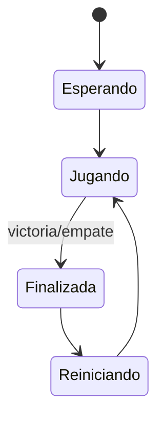

# UT03 — Conecta 4 NGO
## Apuntes de referencia

**Unidad:** UT03 — Autoridad, estado discreto y validación  
**Proyecto:** Conecta 4 NGO  
**Tecnología:** Unity + C# + Netcode for GameObjects (NGO)

---

## Bloque I — Introducción y modelo local

### 1. Propósito

En un juego por turnos no necesitamos sincronizar posiciones continuamente. El problema principal es otro:

- quién puede jugar;
- cuándo puede jugar;
- qué acción solicita;
- quién decide si es válida;
- qué estado debe conservarse;
- cómo reconstruir el tablero cuando una instancia se incorpora más tarde.

La idea central de la unidad es:

```text
EL CLIENTE SOLICITA.
EL SERVIDOR VALIDA.
EL ESTADO PERSISTENTE PERMITE RECONSTRUIR.
LA VISTA REPRESENTA ESE ESTADO.
```

### 2. Qué vas a ser capaz de hacer

Al terminar esta unidad podrás:

- modelar un tablero lógico 7×6;
- separar reglas, estado y vista;
- serializar un snapshot;
- diseñar una frontera de confianza;
- enviar una jugada mediante RPC universal;
- obtener el identificador real del remitente;
- validar jugadas en servidor;
- sincronizar estado discreto;
- reconstruir la vista localmente;
- resolver victoria y empate desde la autoridad;
- coordinar rondas y marcador;
- limitar una partida a dos jugadores;
- tratar desconexiones;
- explicar y probar late join;
- comparar estado agregado con objetos de red individuales;
- diagnosticar errores de arquitectura.

### 3. Resultado de Aprendizaje relacionado

#### RA1

**Desarrolla videojuegos multijugador identificando y relacionando los fundamentos de programación en red cliente-servidor.**

En U03 se trabajan especialmente:

- serialización de datos;
- intercambio de mensajes;
- comandos cliente→servidor;
- procedimientos remotos servidor→clientes;
- eventos de red;
- diseño del modelo cliente.

También se refuerzan elementos de RA2 mediante:

- `NetworkBehaviour`;
- `NetworkVariable`;
- `NetworkList`;
- objetos de red en escena;
- configuración de componentes de networking.

### 4. Producto: Conecta 4 NGO

El producto final es una partida 1v1 donde:

- Host y Client comparten el mismo tablero;
- cada jugador tiene una identidad;
- solo puede jugar quien tiene el turno;
- el servidor valida la petición;
- el tablero lógico es la fuente de verdad;
- la vista se reconstruye a partir del estado;
- victoria y empate se resuelven en servidor;
- el marcador se conserva entre rondas;
- una tercera conexión puede rechazarse;
- una desconexión deja la partida en estado coherente;
- un cliente que entra tarde puede reconstruir el estado actual.

### 5. Idea fundamental: estado discreto

En Pong una pala puede cambiar de posición muchas veces por segundo.

En Conecta 4 el estado cambia solo cuando ocurre una jugada válida.

```text
antes:
tablero = estado A

jugador solicita columna 3

servidor valida

después:
tablero = estado B
```

Esto permite razonar sobre **transiciones discretas de estado**.

### 6. Modelo lógico 7×6

Usaremos:

```text
columnas: 0..6
filas:    0..5
```

Convención:

```text
0 = vacío
1 = jugador 1
2 = jugador 2
```

La fila `0` representa el fondo.

Una jugada no consiste en enviar una posición visual. El servidor recibe una columna y calcula la fila válida.

Ejemplo:

```text
columna 4
→ buscar primera fila vacía
→ colocar jugador actual
→ comprobar victoria/empate
→ cambiar turno
```

### 7. Separación entre reglas, estado y vista

Una arquitectura limpia separa:

```text
ModeloConecta4
→ reglas puras

JuegoConecta4Red
→ autoridad + estado compartido

VistaTableroConecta4
→ representación local
```

Las reglas no deberían depender de Canvas, RPC ni `NetworkManager`.

La vista no debería decidir si una jugada es válida.

---

## Bloque II — Serialización y snapshots

### 8. Qué es un snapshot

Un snapshot es una representación serializable de un estado en un instante.

Puede contener:

- 42 celdas;
- jugador actual;
- número de movimientos;
- estado de la partida;
- puntuación.

Ejemplo conceptual:

```text
SnapshotPartida
├── celdas[42]
├── jugadorActual
├── movimientos
├── estadoPartida
└── puntuaciones
```

### 9. DTO y serialización JSON

Un DTO contiene datos, no comportamiento complejo.

Ejemplo:

```csharp
[System.Serializable]
public sealed class InstantaneaPartida
{
    public byte[] celdas;
    public byte jugadorActual;
    public int numeroMovimientos;
}
```

Serialización:

```csharp
string json = JsonUtility.ToJson(instantanea);
```

Reconstrucción:

```csharp
InstantaneaPartida reconstruida =
    JsonUtility.FromJson<InstantaneaPartida>(json);
```

### 10. Para qué sirve serializar

La serialización permite:

- guardar;
- registrar;
- transportar;
- reconstruir;
- comparar estados.

En esta unidad se utiliza para comprender que el estado lógico puede representarse independientemente de la escena y de la UI.

### 11. Estado actual frente a historial

Para reconstruir una partida no siempre necesitamos conocer todos los eventos anteriores.

Si disponemos de:

```text
tablero actual
+ turno
+ estado de partida
+ marcador
```

podemos reconstruir la situación presente.

Esto será clave para entender late join.

---

## Bloque III — Autoridad, intención y frontera de confianza

### 12. Fuente de verdad

En una arquitectura autoritativa, el cliente propone una acción y el servidor decide si modifica el estado.

No conviene confiar en:

```text
"ya he colocado mi ficha roja en fila 3"
```

Es preferible recibir:

```text
"quiero jugar la columna 4"
```

La segunda opción transmite **intención**, no resultado.

### 13. Trust boundary

La frontera de confianza separa información que el cliente puede proponer de información que el servidor debe decidir.

El cliente puede indicar:

- botón pulsado;
- columna seleccionada.

El servidor decide:

- identidad del remitente;
- turno;
- rango;
- espacio disponible;
- fila;
- jugador que se escribe;
- victoria;
- empate;
- siguiente turno.

### 14. RPC universal cliente→servidor

Con NGO actual podemos utilizar:

```csharp
[Rpc(SendTo.Server)]
private void SolicitarJugadaRpc(
    int columna,
    RpcParams parametrosRpc = default)
{
    ulong idClienteRemitente =
        parametrosRpc.Receive.SenderClientId;
}
```

Puntos importantes:

- `[Rpc]` es el atributo actual;
- `SendTo.Server` envía al servidor;
- el nombre termina en `Rpc`;
- `RpcParams.Receive.SenderClientId` identifica al remitente real.

### 15. Por qué no enviar el identificador del jugador

Un cliente podría intentar enviar:

```text
jugador = 1
```

y hacerse pasar por otro.

La identidad debe derivarse del contexto de red recibido:

```csharp
ulong idClienteRemitente =
    parametrosRpc.Receive.SenderClientId;
```

### 16. Validación autoritativa

Una tubería de validación clara puede seguir este orden:

```text
1. partida activa
2. columna en rango
3. remitente conocido
4. turno correcto
5. columna con espacio
6. calcular fila
7. aplicar jugada
8. comprobar victoria/empate
9. cambiar turno
```

No debe modificarse el estado antes de completar las validaciones necesarias.

### 17. Jugada rechazada

Una petición inválida:

- no cambia tablero;
- no cambia turno;
- no aumenta movimientos;
- puede producir feedback puntual.

Podemos representar el motivo:

```csharp
public enum MotivoRechazoJugada : byte
{
    Ninguno = 0,
    PartidaNoActiva = 1,
    ColumnaInvalida = 2,
    JugadorDesconocido = 3,
    NoEsSuTurno = 4,
    ColumnaLlena = 5
}
```

---

## Bloque IV — Estado persistente sincronizado

### 18. Qué debemos sincronizar

Tenemos dos grandes opciones:

#### Estado agregado

```text
JuegoConecta4Red
├── tablero
├── jugadorActual
├── estadoPartida
├── puntuacionJ1
└── puntuacionJ2
```

Ventajas:

- pocas entidades de red;
- reconstrucción sencilla;
- late join natural;
- reglas concentradas;
- menor lifecycle.

#### Una ficha como `NetworkObject`

Ventajas:

- cada ficha tiene identidad propia;
- permite estudiar spawn/despawn.

Costes:

- hasta 42 objetos;
- más lifecycle;
- mayor complejidad;
- no elimina la necesidad de estado global.

En U03 el núcleo utiliza **estado agregado**.

### 19. `NetworkList<T>`

El tablero puede representarse mediante:

```csharp
private NetworkList<byte> tablero;
```

Creación:

```csharp
private void Awake()
{
    tablero = new NetworkList<byte>();
}
```

Inicialización desde servidor:

```csharp
if (IsServer && tablero.Count == 0)
{
    for (int indice = 0; indice < 42; indice++)
    {
        tablero.Add(0);
    }
}
```

### 20. Índice lineal

Una matriz 7×6 puede almacenarse como lista de 42 elementos.

```text
indice = fila * 7 + columna
```

Ejemplo:

```csharp
private static int ObtenerIndice(int columna, int fila)
{
    return fila * 7 + columna;
}
```

### 21. `NetworkVariable<T>`

El estado escalar puede mantenerse con:

```csharp
NetworkVariable<byte> jugadorActual;
NetworkVariable<byte> estadoPartida;
NetworkVariable<int> puntuacionJ1;
NetworkVariable<int> puntuacionJ2;
```

### 22. Regla de escritura

El estado autoritativo debe modificarse desde el servidor.

```text
cliente
→ intención

servidor
→ valida
→ escribe estado

NGO
→ replica

clientes
→ representan
```

### 23. Eventos de cambio

Para reaccionar al tablero:

```csharp
tablero.OnListChanged += AlCambiarTablero;
```

Para una variable:

```csharp
jugadorActual.OnValueChanged += AlCambiarJugadorActual;
```

Estos callbacks actualizan representación local; no son la fuente de verdad.

---

## Bloque V — Vista derivada del estado

### 24. Qué significa vista derivada

La vista se construye a partir del estado sincronizado.

```text
estado
→ leer celdas
→ colorear tablero
```

No necesitamos sincronizar directamente:

- botones;
- imágenes;
- animaciones;
- Canvas.

### 25. Estado primero, animación después

Una animación puede mejorar la presentación, pero no debe decidir la partida.

```text
servidor modifica tablero
→ estado se replica
→ cliente actualiza vista
→ cliente puede animar
```

Si la animación falla, el estado sigue siendo correcto.

### 26. Aplicar estado inicial

Un cliente que aparece cuando el tablero ya contiene fichas necesita representar el valor actual, no solo escuchar cambios futuros.

Patrón:

```text
OnNetworkSpawn()
→ suscribir eventos
→ leer estado actual
→ reconstruir vista
```

---

## Bloque VI — Victoria, rondas y marcador

### 27. Victoria y empate

Después de una jugada aceptada:

```text
escribir ficha
→ aumentar movimientos
→ comprobar victoria
→ si no, comprobar empate
→ si no, cambiar turno
```

La decisión oficial debe producirse en servidor.

### 28. Estado de partida

Podemos modelar estados como:

```csharp
public enum EstadoPartida : byte
{
    Esperando,
    Jugando,
    Finalizada,
    Reiniciando
}
```

### 29. Máquina de estados de ronda



### 30. Reinicio

Un reinicio coherente puede implicar:

1. limpiar 42 celdas;
2. reiniciar número de movimientos;
3. decidir jugador inicial;
4. establecer `Jugando`;
5. reconstruir la vista.

### 31. Marcador

El marcador pertenece al match, no necesariamente a una sola ronda.

Por eso puede mantenerse fuera del tablero:

```text
ronda 1 termina
→ tablero se limpia
→ puntuación permanece
```

---

## Bloque VII — Conexión y objetos de escena

### 32. Connection approval

Una partida de Conecta 4 admite dos jugadores.

Podemos activar:

```csharp
NetworkManager.Singleton.NetworkConfig.ConnectionApproval = true;
```

y asignar:

```csharp
NetworkManager.Singleton.ConnectionApprovalCallback =
    ComprobarAprobacionConexion;
```

Ejemplo:

```csharp
private void ComprobarAprobacionConexion(
    NetworkManager.ConnectionApprovalRequest solicitud,
    NetworkManager.ConnectionApprovalResponse respuesta)
{
    bool hayHueco =
        NetworkManager.Singleton.ConnectedClientsList.Count < 2;

    respuesta.Approved = hayHueco;
    respuesta.CreatePlayerObject = false;
    respuesta.Pending = false;

    if (!hayHueco)
    {
        respuesta.Reason =
            "Partida completa: máximo 2 jugadores.";
    }
}
```

### 33. Objeto de red colocado en escena

El estado global puede residir en un objeto ya presente:

```text
JuegoRed
├── NetworkObject
└── JuegoConecta4Red
```

Es adecuado porque:

- existe desde el inicio;
- representa estado global;
- no depende de una ficha concreta;
- puede proporcionar estado actual a nuevas instancias.

### 34. PlayerObject no es obligatorio

Si el juego no necesita un avatar persistente por jugador, puede utilizarse:

```csharp
respuesta.CreatePlayerObject = false;
```

La identidad puede gestionarse directamente mediante las conexiones.

---

## Bloque VIII — Desconexión y late join

### 35. Desconexión

Si un jugador abandona durante una ronda:

```text
jugador se desconecta
→ servidor detecta callback
→ resuelve abandono
→ cambia estado
→ limpia referencias
→ informa al jugador restante
```

No debe quedar:

- turno apuntando a alguien inexistente;
- partida activa sin rival;
- reinicios pendientes incoherentes.

### 36. Forfeit

Una política posible:

```text
desconexión durante Jugando
→ Finalizada por abandono
→ actualización de marcador si procede
→ Esperando
```

La política exacta puede variar, pero debe ser determinista y coherente.

### 37. Late join

Un cliente que entra tarde necesita:

- tablero actual;
- turno;
- estado de partida;
- marcador;
- identidad o rol asignado.

No necesita recibir todos los RPC históricos.

### 38. Por qué el estado persistente facilita late join

Si el sistema depende solo de eventos pasados:

```text
cliente nuevo
→ no vio los eventos
→ no puede reconstruir
```

Con estado persistente:

```text
cliente nuevo
→ recibe estado actual
→ reconstruye
```

---

## Bloque IX — Comparación de arquitecturas

### 39. Fichas como `NetworkObject`

Una práctica aislada puede representar una ficha:

```text
FichaRed
├── NetworkObject
└── datos
```

El servidor puede crearla:

```text
Instantiate
→ configurar
→ Spawn()
```

### 40. Estado agregado frente a entidades

| Criterio | Estado agregado | Fichas `NetworkObject` |
|---|---|---|
| Objetos de red | pocos | hasta 42 |
| Fuente de verdad | centralizada | repartida |
| Late join | directo | requiere entidades persistentes |
| Lifecycle | simple | mayor |
| Animación | local | puede ligarse a entidad |
| Complejidad | menor | mayor |
| Valor didáctico | autoridad/estado | spawn/lifecycle |

Ninguna arquitectura es universalmente “mejor”. La decisión depende del problema.

---

## Bloque X — Diagnóstico y robustez

### 41. Método de troubleshooting

```text
síntoma
→ hipótesis
→ prueba mínima
→ observación
→ conclusión
→ corrección
```

### 42. Invariantes útiles

Un invariante es una condición que debe cumplirse siempre.

Ejemplos:

- solo puede jugar un jugador cada turno;
- una columna nunca contiene más de seis fichas;
- un rechazo no modifica el tablero;
- Host y Client tienen el mismo tablero;
- una ronda finalizada no acepta nuevas jugadas;
- no hay más de dos jugadores admitidos.

### 43. Pruebas negativas

No basta comprobar el camino correcto.

Hay que probar:

- columna `-1`;
- columna `7`;
- columna llena;
- jugador fuera de turno;
- petición durante estado no activo;
- tercera conexión;
- desconexión;
- late join.

### 44. Síntomas frecuentes

#### Host ve una ficha y Client no

Comprobar:

- si el estado realmente se sincronizó;
- si la vista se suscribió;
- si se aplicó estado inicial;
- si solo se actualizó UI en Host.

#### Client juega dos veces

Comprobar:

- cambio de turno en servidor;
- identidad del remitente;
- orden de validación.

#### Late join ve tablero vacío

Comprobar:

- si el tablero es estado persistente;
- si la vista lee el estado actual en `OnNetworkSpawn()`.

#### Tercera instancia entra

Comprobar:

- activación de `ConnectionApproval`;
- callback;
- número de conexiones aceptadas.

#### Marcador suma dos veces

Comprobar:

- que solo servidor modifica score;
- que no existen dos rutas para contabilizar el mismo resultado.

---

## Bloque XI — Síntesis y consulta

### 45. Mapa de API de U03

| Componente / elemento | Propiedad / método utilizado | Para qué lo usamos |
|---|---|---|
| `NetworkBehaviour` | `IsServer` | Garantizar que solo servidor modifica estado autoritativo. |
| `NetworkBehaviour` | `OnNetworkSpawn()` | Suscribir eventos y aplicar estado inicial. |
| `[Rpc]` | `SendTo.Server` | Enviar intención de jugada desde cliente a servidor. |
| `RpcParams` | `Receive.SenderClientId` | Obtener la identidad real del remitente. |
| `NetworkList<T>` | `Add()` / índice | Mantener las 42 celdas sincronizadas. |
| `NetworkList<T>` | `OnListChanged` | Reaccionar localmente a cambios del tablero. |
| `NetworkVariable<T>` | `Value` | Mantener turno, estado y marcador. |
| `NetworkVariable<T>` | `OnValueChanged` | Actualizar representación cuando cambia un valor. |
| `NetworkManager` | `ConnectedClientsList` | Saber cuántos clientes están conectados. |
| `NetworkConfig` | `ConnectionApproval` | Activar aprobación de conexiones. |
| `NetworkManager` | `ConnectionApprovalCallback` | Decidir si una conexión se acepta. |
| `ConnectionApprovalResponse` | `Approved` | Aceptar o rechazar. |
| `ConnectionApprovalResponse` | `CreatePlayerObject` | Decidir si se crea PlayerObject. |
| `ConnectionApprovalResponse` | `Reason` | Comunicar motivo de rechazo. |
| `NetworkObject` | componente de escena | Dar identidad de red al objeto global de partida. |
| `NetworkObject` | `Spawn()` | Crear una entidad de red en la práctica comparativa. |
| `NetworkObject` | `Despawn()` | Retirar una entidad de red cuando corresponda. |
| `JsonUtility` | `ToJson()` | Serializar snapshot. |
| `JsonUtility` | `FromJson<T>()` | Reconstruir snapshot. |

### 46. Referencia detallada

#### 46.1. `[Rpc(SendTo.Server)]`

Permite que un cliente solicite una acción al servidor.

```csharp
[Rpc(SendTo.Server)]
private void SolicitarJugadaRpc(
    int columna,
    RpcParams parametrosRpc = default)
```

El parámetro enviado debe expresar intención mínima.

#### 46.2. `RpcParams.Receive.SenderClientId`

Permite obtener el identificador de la conexión que realmente envió el RPC.

```csharp
ulong idClienteRemitente =
    parametrosRpc.Receive.SenderClientId;
```

No sustituirlo por un identificador inventado por el cliente.

#### 46.3. `NetworkList<T>`

Útil para colecciones sincronizadas de longitud variable o indexable.

En U03 representa las 42 celdas.

Operaciones relevantes:

- `Count`;
- `Add()`;
- acceso por índice;
- `OnListChanged`.

#### 46.4. `NetworkVariable<T>`

Útil para estado escalar:

- turno;
- estado;
- puntuaciones;
- jugador inicial.

Propiedades/eventos relevantes:

- `Value`;
- `OnValueChanged`.

#### 46.5. `ConnectionApproval`

Elementos utilizados:

| Elemento | Función |
|---|---|
| `NetworkConfig.ConnectionApproval` | Activa el mecanismo. |
| `ConnectionApprovalCallback` | Define la lógica de aceptación. |
| `ConnectionApprovalRequest` | Contiene la petición entrante. |
| `ConnectionApprovalResponse.Approved` | Acepta/rechaza. |
| `CreatePlayerObject` | Controla creación automática de PlayerObject. |
| `Pending` | Indica si la decisión queda pendiente. |
| `Reason` | Motivo observable de rechazo. |

#### 46.6. `NetworkObject`

En U03 aparece de dos formas:

1. objeto global colocado en escena;
2. entidad creada dinámicamente en la comparación de fichas.

Esto permite comparar:

```text
estado centralizado
vs
muchas entidades de red
```

### 47. Qué debes reconocer de un vistazo

```csharp
[Rpc(SendTo.Server)]
```

> El cliente está enviando una solicitud al servidor.

```csharp
parametrosRpc.Receive.SenderClientId
```

> Se obtiene la identidad real de quien envió la petición.

```csharp
if (!IsServer)
{
    return;
}
```

> La operación está restringida al servidor.

```csharp
tablero.OnListChanged += AlCambiarTablero;
```

> La vista reacciona a cambios de estado.

```csharp
jugadorActual.Value
```

> Se consulta el turno sincronizado.

```csharp
respuesta.Approved = false;
```

> La conexión se rechaza.

### 48. Glosario

**Autoridad:** responsabilidad de decidir el estado válido.

**Estado agregado:** representación centralizada de varios datos relacionados.

**Frontera de confianza:** límite entre datos que el cliente puede proponer y decisiones que el servidor debe validar.

**Intento / intención:** acción solicitada por el cliente antes de ser validada.

**Late join:** incorporación de un cliente cuando la partida ya ha comenzado.

**Snapshot:** representación serializable del estado actual.

**Estado persistente:** información que debe seguir disponible para reconstruir el presente.

**Vista derivada:** representación local calculada a partir del estado.

**Invariante:** condición que debe cumplirse siempre.

**Forfeit:** derrota o finalización producida por abandono/desconexión.

### 49. Autoevaluación

1. ¿Por qué Conecta 4 no necesita sincronización continua de transformaciones?
2. ¿Qué diferencia hay entre intención y resultado?
3. ¿Por qué el servidor debe obtener el remitente desde `RpcParams`?
4. ¿Qué validaciones deben ocurrir antes de cambiar el tablero?
5. ¿Qué diferencia existe entre una jugada rechazada y una aceptada?
6. ¿Por qué `NetworkList<byte>` resulta adecuada para el tablero?
7. ¿Qué datos encajan mejor en `NetworkVariable<T>`?
8. ¿Qué diferencia hay entre estado sincronizado y vista?
9. ¿Por qué la vista debe aplicar también el estado inicial?
10. ¿Dónde debe resolverse victoria/empate?
11. ¿Qué información necesita un cliente que entra tarde?
12. ¿Por qué los RPC históricos no bastan para late join?
13. ¿Para qué sirve `ConnectionApproval`?
14. ¿Por qué puede desactivarse la creación automática de PlayerObject?
15. ¿Qué riesgo existe al representar cada ficha como `NetworkObject`?
16. ¿Qué significa que el tablero sea la fuente de verdad?
17. ¿Qué ocurre si un jugador se desconecta durante `Jugando`?
18. Define un invariante útil para esta unidad.
19. ¿Qué diferencia existe entre probar una jugada correcta y una prueba negativa?
20. Explica el flujo completo cliente → servidor → estado → vista.

### 50. Referencias oficiales

- Unity Manual — Netcode for GameObjects
- documentación de `NetworkVariable`
- documentación de `NetworkList`
- documentación de RPC universal
- documentación de Connection Approval
- documentación de `NetworkObject`
