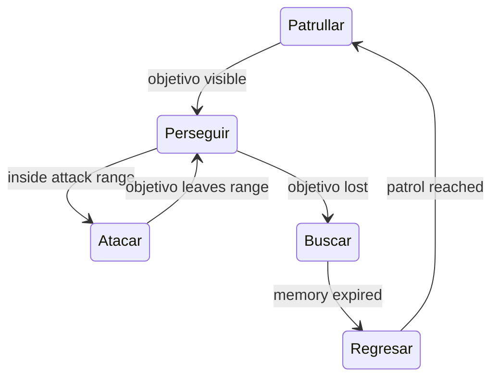
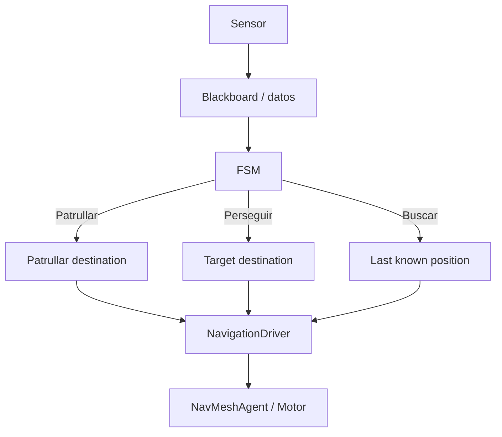

## Apuntes de referencia

**Unidad:** UT04 — IA aplicada: percepción, decisión y navegación  
**Proyecto:** `Tanks AI Lab`  
**Tecnología:** Unity + C# + AI Navigation

---

## Bloque I — Introducción

### 1. Propósito

En esta unidad construirás agentes capaces de:

```text
percibir
→ recordar
→ decidir
→ buscar una ruta
→ navegar
→ moverse
→ explicar por qué actuaron así
```

El objetivo no es crear un “bot perfecto”, sino una IA **observable, modular, comprobable y depurable**.

### 2. Qué vas a ser capaz de hacer

Al terminar la unidad podrás:

- relacionar problemas de videojuego con técnicas de IA adecuadas;
- calcular distancia y dirección hacia un objetivo;
- construir un campo de visión;
- comprobar línea de visión;
- conservar una última posición conocida;
- modelar comportamiento mediante FSM;
- separar percepción, decisión y actuación;
- patrullar con puntos de paso;
- representar el espacio mediante una rejilla;
- explicar y ejecutar A*;
- reconstruir y seguir rutas;
- utilizar `NavMeshSurface` y `NavMeshAgent`;
- trabajar con áreas, costes, obstáculos y links;
- distinguir navegación global de steering local;
- comparar FSM con una arquitectura jerárquica;
- diagnosticar comportamiento mediante gizmos, estados y rutas visibles.

### 3. Resultados de Aprendizaje relacionados

#### RA4

**Aplica conceptos básicos de inteligencia artificial en el diseño de videojuegos.**

En esta unidad se trabajan especialmente la identificación de conceptos fundamentales y la asociación entre técnicas de IA y problemas concretos del videojuego.

#### RA5

**Identifica y relaciona elementos propios de la inteligencia artificial y el aprendizaje automático en el desarrollo de videojuegos.**

En esta unidad se trabajan especialmente:

- movimiento automático;
- obstáculos, atajos, colisiones y toma de decisiones;
- navegación automática;
- representación de áreas;
- procedimientos de IA integrados en el motor;
- comportamientos relacionados con visualización y movimiento.

### 4. Producto: Tanks AI Lab

El proyecto se divide en laboratorios independientes:

```text
LaboratorioPercepcion_2D
ArenaFSM_2D
LaboratorioRejillaAEstrella_2D
ArenaNavMesh_3D
MicroLaboratorioSteering
```

Cada laboratorio aísla un problema. Al final, los conceptos se integran en un agente capaz de **percibir, decidir y navegar**.

### 5. IA clásica, aprendizaje automático y aprendizaje por refuerzo

En videojuegos, “IA” puede referirse a técnicas distintas.

#### IA programada o clásica

El comportamiento se define mediante reglas y algoritmos:

```text
si veo al jugador
→ perseguir

si lo pierdo
→ buscar última posición conocida
```

Ejemplos de esta unidad:

- sensores;
- FSM;
- A*;
- NavMesh;
- steering.

#### Aprendizaje automático

El comportamiento se obtiene a partir de datos o entrenamiento.

#### Aprendizaje por refuerzo

Un agente aprende una política mediante:

```text
observaciones
→ acciones
→ recompensas
→ episodios
```

La implementación con ML-Agents se aborda en U05.

La pregunta adecuada no es:

> “¿Qué técnica es mejor?”

sino:

> “¿Qué problema tengo que resolver y qué técnica encaja mejor?”


## Bloque II — Percepción y memoria

### 6. Percepción: posición, desplazamiento, distancia y dirección

Supón:

```text
posicionAgente = (2, 1)
posicionObjetivo = (7, 4)
```

El vector desde el agente al objetivo es:

```text
haciaObjetivo = posicionObjetivo - posicionAgente
         = (5, 3)
```

#### Magnitud

La magnitud representa distancia:

```text
distancia = |haciaObjetivo|
```

En Unity:

```csharp
Vector2 haciaObjetivo = objetivo.position - transform.position;
float distancia = haciaObjetivo.magnitude;
```

#### Dirección normalizada

```csharp
Vector2 direccion = haciaObjetivo.normalized;
```

`direccion` tiene longitud 1 salvo vector cero.

##### Error frecuente

Incorrecto:

```csharp
Vector2 haciaObjetivo = (objetivo.position - transform.position).normalized;
float distancia = haciaObjetivo.magnitude;
```

El resultado de `distancia` será aproximadamente `1`, porque ya normalizaste.

Mejor:

```csharp
Vector2 desplazamiento = objetivo.position - transform.position;
float distancia = desplazamiento.magnitude;
Vector2 direccion = distancia > 0.0001f
    ? desplazamiento / distancia
    : Vector2.zero;
```

---

### 7. Campo de visión

Un enemigo no debería detectar automáticamente todo lo que está a cierta distancia.

Queremos comprobar:

1. rango;
2. dirección;
3. campo angular;
4. línea de visión.

#### Ángulo

Podemos usar:

```csharp
float angle = Vector2.Angle(transform.right, directionToTarget);
bool insideFov = angle <= fieldOfViewDegrees * 0.5f;
```

Otra posibilidad es producto escalar:

```text
dot(frente, direccion)
```

Si ambos vectores están normalizados:

```text
dot = cos(angle)
```

La condición puede expresarse como:

```csharp
float threshold =
    Mathf.Cos(fieldOfViewDegrees * 0.5f * Mathf.Deg2Rad);

bool inside =
    Vector2.Dot(transform.right, directionToTarget) >= threshold;
```

El enfoque con `Vector2.Angle` suele ser más legible al principio. El dot product es útil para comprender qué se está comparando.

---

### 8. Línea de visión con raycast

Estar dentro del FOV no significa ser visible.

Puede haber:

```text
Agent → pared → Target
```

Un raycast responde:

> ¿qué collider encuentro primero en esta dirección?

Ejemplo 2D:

```csharp
RaycastHit2D hit = Physics2D.Raycast(
    origin,
    direccion,
    maxDistance,
    visibilityMask
);
```

La condición final puede ser:

```text
inside range
AND inside FOV
AND first relevant hit is objetivo
```

No uses raycast como sustituto del FOV. Resuelven preguntas distintas.

---

### 9. Memoria de percepción

Un enemigo que pierde al jugador no tiene por qué olvidar instantáneamente.

Estado mínimo:

```text
PuedeVerObjetivo
LastKnownPosition
LastSeenTime
```

Política:

```text
si veo
→ actualizo última posición
si no veo pero memoria vigente
→ puedo buscar allí
si timeout termina
→ olvido
```

Ejemplo:

```csharp
if (puedeVerObjetivo)
{
    ultimaPosicionConocida = objetivo.position;
    lastSeenTime = Time.time;
    hasMemory = true;
}

if (hasMemory && Time.time - lastSeenTime > memorySeconds)
{
    hasMemory = false;
}
```

La memoria debe tener caducidad. Una última posición eterna convierte información antigua en “verdad”.

---

### 10. Depuración visual

Dibuja:

- rango;
- límites de FOV;
- raycast;
- última posición conocida;
- estado de FSM;
- ruta.

Un agente depurable debería poder responder visualmente:

```text
qué ve
qué recuerda
qué decide
adónde intenta ir
```

---

## Bloque III — Decisión mediante FSM

### 11. FSM: por qué usar estados

Código difícil de mantener:

```csharp
if (puedeVer)
{
    if (estaCerca)
    {
        if (municion > 0)
        {
            ...
        }
    }
    else
    {
        ...
    }
}
else
{
    ...
}
```

Una FSM hace explícita la situación actual.

Ejemplo:

```csharp
public enum EstadoEnemigo
{
    Patrullar,
    Perseguir,
    Atacar,
    Buscar,
    Regresar
}
```

Las transiciones forman un modelo:



---

### 12. Estado, transición, condición y acción

**Estado**: situación actual.

**Condición**: hecho evaluable.

**Transición**: cambio entre estados.

**Acción**: comportamiento mientras se está en el estado.

Ejemplo:

```text
estado: Patrullar
condición: PuedeVerObjetivo == true
transición: Patrullar → Perseguir
acción Perseguir: mover hacia objetivo
```

Evita que el sensor decida directamente:

```text
sensor detecta → sensor mueve
```

Mejor:

```text
sensor produce datos
→ controlador decide
→ motor ejecuta
```

---

### 13. Arquitectura modular

Una separación razonable:

```text
SensorPercepcion2D
    datos de percepción

ControladorFSM
    estado y transiciones

MotorTanque2D
    movimiento

RutaPatrulla2D
    puntos de patrulla
```

Contrato conceptual:

```text
Sensor:
    no decide ruta

FSM:
    no hace raycasts directamente si el sensor ya los centraliza

Motor:
    no decide estado

Vista/Gizmos:
    no cambia la decisión
```

---

### 14. Puntos de paso y patrulla

Un ruta de patrulla puede almacenar:

```csharp
[SerializeField]
private Transform[] puntos;
```

Movimiento conceptual:

```text
ir a waypoint actual
si llego
→ siguiente
si llego al último
→ volver al primero
```

El proyecto inicial incluye `RutaPatrulla2D` como infraestructura, pero no implementa el ciclo de patrulla completo.

---

## Bloque IV — Rejillas, búsqueda y A*

### 15. Representar el espacio con una rejilla

Para A* necesitamos discretizar el espacio.

Nodo:

```text
gridX
gridY
walkable
cost
parent
g
h
f = g + h
```

Cada celda representa una zona del mundo.

Conceptos:

- **walkable**: se puede atravesar;
- **neighbour**: celda conectada;
- **cost**: coste de llegar;
- **parent**: nodo desde el que llegamos;
- **g**: coste desde inicio;
- **h**: estimación al objetivo;
- **f**: coste estimado total.

---

### 16. Conversión rejilla ↔ mundo

Si:

```text
origin = origen de rejilla
cellSize = tamaño de celda
```

una conversión sencilla:

```csharp
Vector3 CellToWorld(int x, int y)
{
    return origin +
        new Vector3(
            (x + 0.5f) * cellSize,
            (y + 0.5f) * cellSize,
            0f
        );
}
```

El `0.5` lleva al centro de la celda.

El proyecto inicial contiene `ConfiguracionRejilla` con helpers básicos, pero la rejilla visual completa es parte de S48.

---

### 17. A*: intuición

A* intenta equilibrar:

```text
lo que ya me ha costado
+
lo que estimo que falta
```

```text
g = coste desde start
h = heurística hasta objetivo
f = g + h
```

Pseudocódigo:

```text
abiertos = {start}
cerrados = {}

mientras abiertos no vacío:
    actual = nodo con menor f

    si actual == objetivo:
        reconstruir ruta

    quitar actual de abiertos
    añadir actual a cerrados

    para cada neighbour:
        si bloqueado o en cerrados:
            continuar

        tentativeG = actual.g + coste(actual, neighbour)

        si neighbour no está en abiertos
           o tentativeG < neighbour.g:
            neighbour.parent = actual
            neighbour.g = tentativeG
            neighbour.h = heuristic(neighbour, objetivo)

            si no está en abiertos:
                añadir
```

---

### 18. Heurística

En una rejilla 4-direcciones, Manhattan:

```text
h = |dx| + |dy|
```

Si hay diagonales, la heurística debe ser coherente con los movimientos permitidos.

No se exige estudiar optimizaciones avanzadas. El objetivo es comprender la relación:

```text
representación espacial
→ búsqueda
→ ruta
→ movimiento
```

---

### 19. Conjuntos abiertos y cerrados

**Open**: candidatos pendientes.

**Closed**: nodos ya procesados.

Error frecuente:

```text
no usar cerrados
```

Consecuencia:

- revisitas innecesarias;
- bucles lógicos;
- búsqueda muy difícil de depurar.

Visualiza ambos conjuntos durante una práctica si te ayuda.

---

# 21. Reconstrucción del ruta

Cuando alcanzas objetivo:

```text
objetivo.parent
→ parent.parent
→ ...
→ start
```

Eso produce la ruta al revés.

Algoritmo:

```csharp
List<Nodo> ruta = new();

Nodo actual = objetivo;

while (actual != start)
{
    ruta.Add(actual);
    actual = actual.Parent;
}

ruta.Reverse();
```

Después:

```text
ruta de nodos
→ posiciones del mundo
→ waypoints de movimiento
```

---

### 21. Seguir una ruta

El agente no debe “teletransportarse” al siguiente nodo.

Patrón:

```text
ruta[index]
→ convertir a world
→ mover hacia punto
→ si distancia < tolerance
→ index++
```

Comprueba:

- tolerancia;
- velocidad;
- ruta vacío;
- objetivo alcanzado;
- nuevo ruta.

---

## Bloque V — AI Navigation y NavMesh

### 22. De A* manual a AI Navigation

A* te permite comprender qué significa buscar una ruta.

AI Navigation automatiza gran parte del trabajo:

```text
representar superficie navegable
→ generar NavMesh
→ colocar NavMeshAgent
→ SetDestination
→ motor calcula ruta
```

No significa que “el motor tenga IA completa”.

Tú sigues decidiendo:

- cuándo perseguir;
- cuál es el destino;
- cuándo recalcular;
- qué áreas son caras;
- qué hacer si no existe ruta.

---

### 23. `NavMeshSurface`

En la escena `UT04_04_NavMesh_Arena_3D` encontrarás un `NavMeshRoot` con `NavMeshSurface`.

Proceso:

1. selecciona `NavMeshRoot`;
2. revisa `NavMeshSurface`;
3. configura geometría/agent type;
4. genera o actualiza NavMesh;
5. observa superficie navegable.

Resultado esperado:

```text
suelo navegable
obstáculos excluidos o tratados
```

---

### 24. `NavMeshAgent`

El `Agent` 3D incluye `NavMeshAgent`.

Ejemplo:

```csharp
using UnityEngine.AI;

public sealed class NavMeshDestinationDriver : MonoBehaviour
{
    [SerializeField] private NavMeshAgent agent;
    [SerializeField] private Transform objetivo;

    public void MoveToTarget()
    {
        if (agent == null || objetivo == null)
        {
            return;
        }

        agent.SetDestination(objetivo.position);
    }
}
```

En el proyecto inicial el método está preparado, pero debes decidir cuándo llamarlo.

No llames a `SetDestination` cada frame por costumbre. Decide si el destino cambió lo suficiente o si el estado exige recálculo.

---

### 25. Áreas y costes

NavMesh puede distinguir áreas:

```text
Walkable
Mud
Road
Danger
```

Un coste alto no significa “prohibido”. Significa:

```text
preferir otra ruta si compensa
```

Práctica:

- crear dos rutas;
- aumentar coste de una;
- observar si cambia la elección.

Eso convierte un concepto abstracto en una decisión visible.

---

### 26. `NavMeshObstacle`

Un obstáculo puede:

- bloquear;
- provocar replanning;
- usar carving cuando corresponda.

Pregunta:

> ¿Es un obstáculo estático de geometría o un objeto dinámico que cambia el espacio?

No configures todo igual.

---

### 27. `NavMeshLink`

Un link representa una conexión especial:

```text
salto
puerta
escalera
paso entre superficies
```

Sirve para explicar que el grafo de navegación puede incluir relaciones que no son simplemente “suelo contiguo”.

---

## Bloque VI — Integración, steering y arquitecturas de decisión

### 28. Integrar percepción, decisión y navegación

Arquitectura final:



El sensor no mueve.

La FSM no dibuja el tablero.

El `NavMeshAgent` no decide si debe perseguir.

Cada capa resuelve su problema.

---

### 29. Steering: navegación global frente a movimiento local

Navegación global:

```text
¿por dónde debo ir?
```

Steering local:

```text
¿cómo debo moverme ahora?
```

#### BuscarObjetivo

```text
velocidadDeseada =
    normalized(objetivo - position) * maxSpeed
```

#### Huir

```text
velocidadDeseada =
    normalized(position - threat) * maxSpeed
```

#### Llegar

Reduce velocidad cerca del destino.

#### EvitarObstaculos

Modifica temporalmente movimiento para evitar colisión.

No sustituyas A*/NavMesh con direccionAjuste. Un agente puede evitar una pared cercana y aun así no saber cómo llegar al otro lado del mapa.

---

### 30. FSM frente a Behaviour Tree

FSM:

```text
estado actual único
+ transiciones explícitas
```

BT:

```text
selector / sequence
→ condiciones
→ acciones
```

En UT04 solo necesitas comparar.

Una FSM puede ser excelente para:

```text
Patrullar
Perseguir
Atacar
Buscar
```

Un árbol puede resultar útil cuando aumentan:

- prioridades;
- alternativas;
- combinaciones;
- subobjetivos.

No conviertas el hito en implementar un framework completo de BT.

---

## Bloque VII — Diagnóstico

### 31. Diagnóstico y troubleshooting

#### El objetivo está delante pero no se detecta

Comprueba:

1. distancia;
2. vector frente;
3. ángulo/FOV;
4. layer mask;
5. raycast;
6. collider del objetivo;
7. collider del obstáculo.

#### Detecta a través de pared

Probable causa:

- FOV funciona, LOS no.

#### FSM cambia de estado continuamente

Comprueba:

- condiciones mutuamente contradictorias;
- falta de hysteresis/tolerancia;
- transición entrada/salida con mismo umbral;
- sensor fluctuante.

#### A* no encuentra ruta

Comprueba:

- start/objetivo walkable;
- vecinos;
- cerrados;
- conversiones grid/world;
- obstáculos;
- coste.

#### Ruta correcta, agente desviado

Comprueba:

- centro de celda;
- tolerancia;
- escala;
- origen;
- velocidad.

#### NavMeshAgent no se mueve

Comprueba:

- existe NavMesh;
- agent está colocado sobre superficie;
- `isOnNavMesh`;
- destino válido;
- stoppingDistance;
- ruta status.

---


## Bloque VIII — Síntesis y consulta

### 32. Mapa compacto de API de U04

| Componente / elemento | Propiedad / método utilizado | Para qué lo usamos |
|---|---|---|
| `Transform` | `position` | Obtener posiciones del agente, objetivo y puntos de paso. |
| `Vector2` / `Vector3` | `magnitude` | Calcular distancia. |
| `Vector2` / `Vector3` | `normalized` | Obtener una dirección de longitud 1. |
| `Vector2` / `Vector3` | `Dot()` | Comparar orientación para construir el FOV. |
| `Physics2D` | `Raycast()` | Comprobar línea de visión en 2D. |
| `Physics` | `Raycast()` | Comprobar línea de visión en 3D cuando proceda. |
| `LayerMask` | máscara | Limitar qué capas pueden bloquear o ser detectadas. |
| `Gizmos` | `DrawLine()` / `DrawWireSphere()` | Visualizar percepción, rutas y rangos. |
| `Debug` | `DrawRay()` | Visualizar rayos durante la ejecución. |
| `Mathf` | `Acos()` / `Rad2Deg` | Convertir producto escalar en ángulo cuando se necesita. |
| `Mathf` | `Clamp()` / `Clamp01()` | Limitar valores numéricos. |
| `NavMeshSurface` | `BuildNavMesh()` / bake | Construir la representación navegable. |
| `NavMeshAgent` | `SetDestination()` | Solicitar navegación hacia un destino. |
| `NavMeshAgent` | `remainingDistance` | Saber cuánto falta para llegar. |
| `NavMeshAgent` | `pathPending` | Saber si el cálculo de ruta está pendiente. |
| `NavMeshAgent` | `stoppingDistance` | Definir la distancia de parada. |
| `NavMeshAgent` | `speed` | Configurar velocidad máxima. |
| `NavMeshObstacle` | carving | Modificar zonas navegables ante obstáculos. |
| `NavMeshLink` | endpoints / coste | Conectar regiones separadas. |
| `Transform[]` | colección | Mantener puntos de patrulla. |
| `List<Nodo>` | colección | Mantener conjuntos y rutas de A*. |
| `Dictionary` / referencias de nodo | procedencia | Reconstruir una ruta desde meta a origen. |
| `Time` | `deltaTime` | Actualizar memoria y movimiento dependiente del tiempo. |

### 33. Referencia detallada por subsistemas

#### 33.1. Percepción

| Elemento | Propiedad / método | Función |
|---|---|---|
| `Transform` | `position` | Posición actual. |
| `Vector2` | resta | Obtener desplazamiento hacia el objetivo. |
| `Vector2` | `magnitude` | Distancia. |
| `Vector2` | `normalized` | Dirección. |
| `Vector2` | `Dot()` | Determinar alineación con la dirección frontal. |
| `Physics2D` | `Raycast()` | Detectar oclusión. |
| `LayerMask` | máscara | Filtrar objetivos y obstáculos. |
| `Gizmos` | dibujo | Hacer observable lo que percibe el agente. |

#### 33.2. Memoria

Elementos propios habituales:

| Elemento propio | Función |
|---|---|
| `ultimaPosicionConocida` | Conservar dónde se vio por última vez el objetivo. |
| `duracionMemoria` | Tiempo máximo durante el que el dato sigue siendo válido. |
| `temporizadorMemoria` | Controlar cuánto tiempo ha pasado. |
| `puedeVerObjetivo` | Indicar si existe percepción directa en este instante. |

Patrón:

```text
ve objetivo
→ actualizar posición conocida
→ reiniciar temporizador

deja de verlo
→ conservar posición durante un tiempo
→ caducar memoria
```

#### 33.3. FSM

Elementos propios habituales:

| Elemento | Función |
|---|---|
| `EstadoEnemigo` | Enumerar situaciones posibles. |
| `estadoActual` | Conservar la situación activa. |
| `CambiarEstado()` | Centralizar transiciones. |
| `ActualizarPatrulla()` | Ejecutar comportamiento de patrulla. |
| `ActualizarPersecucion()` | Ejecutar persecución. |
| `ActualizarBusqueda()` | Ir a última posición conocida. |
| `ActualizarRegreso()` | Volver a patrulla. |

#### 33.4. Rejilla y A*

| Elemento | Función |
|---|---|
| `Nodo` | Representar una celda navegable o bloqueada. |
| `costeG` | Coste acumulado desde el origen. |
| `costeH` | Estimación hasta el objetivo. |
| `costeF` | `g + h`. |
| `procedencia` | Nodo desde el que se llegó. |
| conjunto abierto | Nodos candidatos. |
| conjunto cerrado | Nodos ya procesados. |
| `ObtenerVecinos()` | Generar sucesores. |
| `CalcularHeuristica()` | Estimar coste restante. |
| `ReconstruirRuta()` | Recuperar el camino final. |

#### 33.5. AI Navigation

| Componente | Propiedad / método | Función |
|---|---|---|
| `NavMeshSurface` | configuración / bake | Crear superficie navegable. |
| `NavMeshAgent` | `SetDestination()` | Solicitar destino. |
| `NavMeshAgent` | `remainingDistance` | Medir distancia restante por ruta. |
| `NavMeshAgent` | `pathPending` | Evitar evaluar una ruta todavía no calculada. |
| `NavMeshAgent` | `stoppingDistance` | Evitar sobrepasar el objetivo. |
| `NavMeshObstacle` | carving | Adaptar navegación a obstáculos. |
| `NavMeshLink` | conexión | Representar saltos, puertas o discontinuidades. |

#### 33.6. Steering

| Técnica | Propósito |
|---|---|
| Buscar objetivo | Orientar movimiento hacia un punto. |
| Huir | Generar dirección opuesta al peligro. |
| Llegar | Reducir velocidad al aproximarse. |
| Evitar obstáculos | Corregir movimiento local ante colisiones probables. |

### 34. Componentes que no deben confundirse

```text
sensor
≠
decisor
≠
navegador
≠
motor
≠
vista de depuración
```

Una arquitectura mantenible evita que una única clase:

- detecte;
- decida;
- calcule ruta;
- mueva;
- dibuje;
- y cambie estado.

### 35. Qué debes reconocer de un vistazo

```csharp
Vector2 desplazamiento =
    objetivo.position - transform.position;
```

> Vector desde el agente hacia el objetivo.

```csharp
float distancia = desplazamiento.magnitude;
```

> Distancia actual.

```csharp
Vector2 direccion = desplazamiento.normalized;
```

> Dirección unitaria.

```csharp
Physics2D.Raycast(...)
```

> Comprobación de línea de visión.

```csharp
agenteNavMesh.SetDestination(destino);
```

> Solicitud de navegación usando NavMesh.

```csharp
agenteNavMesh.remainingDistance
```

> Distancia restante siguiendo la ruta calculada.

### 36. Glosario

**Agente:** entidad que percibe un entorno y ejecuta acciones.

**Percepción:** obtención de información relevante del entorno.

**FOV:** región angular que representa el campo de visión.

**Línea de visión:** comprobación de que no existe un obstáculo bloqueando el objetivo.

**Memoria:** información temporal conservada después de perder percepción directa.

**FSM:** máquina de estados finitos.

**Estado:** situación actual del agente.

**Transición:** cambio de un estado a otro.

**Waypoint / punto de paso:** posición utilizada para patrulla o navegación.

**Rejilla:** discretización del espacio en celdas.

**Nodo:** elemento de la representación de búsqueda.

**Heurística:** estimación del coste restante hasta el objetivo.

**A\*:** algoritmo de búsqueda informada que combina coste recorrido y estimación.

**NavMesh:** representación navegable utilizada por AI Navigation.

**Steering:** técnicas de movimiento local que generan o ajustan una dirección.

**Behaviour Tree:** estructura jerárquica de decisión utilizada en IA de videojuegos.

### 37. Autoevaluación

1. ¿Qué diferencia hay entre distancia y dirección?
2. ¿Por qué normalizar antes de medir distancia produce un error?
3. ¿Qué condiciones deben cumplirse para que un objetivo sea visible?
4. ¿Qué aporta un raycast al FOV?
5. ¿Para qué sirve una memoria de última posición conocida?
6. ¿Qué diferencia existe entre sensor y decisor?
7. ¿Qué elementos forman una FSM?
8. ¿Por qué conviene centralizar los cambios de estado?
9. ¿Qué responsabilidad tiene el motor de movimiento?
10. ¿Qué representa una rejilla?
11. ¿Qué significan `g`, `h` y `f` en A*?
12. ¿Qué diferencia existe entre conjunto abierto y cerrado?
13. ¿Cómo se reconstruye una ruta?
14. ¿Qué diferencia hay entre calcular una ruta y seguirla?
15. ¿Qué problema resuelve `NavMeshSurface`?
16. ¿Qué hace `NavMeshAgent.SetDestination()`?
17. ¿Qué utilidad tiene `remainingDistance`?
18. ¿Para qué sirven las áreas y costes?
19. ¿Qué problema resuelve `NavMeshObstacle`?
20. ¿Cuándo usarías `NavMeshLink`?
21. ¿Qué diferencia existe entre navegación global y steering local?
22. ¿Por qué los gizmos son una herramienta de depuración y no solo estética?
23. ¿Qué síntomas indicarían un fallo de percepción?
24. ¿Qué síntomas indicarían un fallo de decisión?
25. Explica el flujo percepción → memoria → decisión → navegación → movimiento.

### 38. Referencias oficiales

- Unity Manual — AI Navigation
- documentación de `NavMeshSurface`
- documentación de `NavMeshAgent`
- documentación de `Physics2D.Raycast`
- documentación de `Gizmos`
