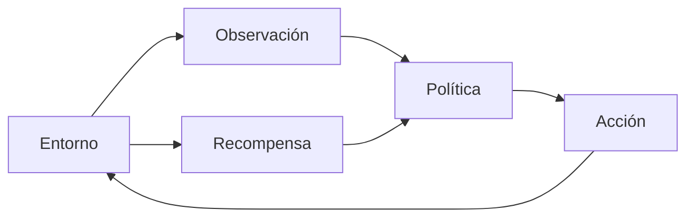

## Apuntes de referencia completos

**Proyecto:** `ML-Agents Training Arena`

**Baseline técnico:** Unity `6000.3.13f1` · ML-Agents Unity `4.0.0` · Python `3.10.12` · `mlagents==1.1.0` · Unity Version Control (UVCS)

---

# Cómo utilizar estos apuntes

Estos apuntes sirven como **documento de referencia completo** de la unidad. No sustituyen las actividades ni los experimentos de laboratorio.

La unidad sigue este hilo:

```text
problema de decisión
→ entorno y episodio
→ observaciones
→ acciones
→ recompensa
→ entrenamiento
→ modelo
→ evaluación
→ experimento
→ generalización
→ diagnóstico
→ aplicación
```

Principio central:

> **El algoritmo optimiza la recompensa definida; no conoce directamente la intención humana.**

---

# BLOQUE I — De la IA programada al aprendizaje por refuerzo

## 1. IA programada frente a política aprendida

En una IA programada, el comportamiento está escrito explícitamente.

Ejemplo:

```text
observación
→ regla programada
→ acción
```

Una FSM, A*, NavMesh o un conjunto de reglas puede ser una solución excelente cuando el comportamiento deseado puede expresarse de forma clara, estable y explicable.

En aprendizaje por refuerzo —**Reinforcement Learning, RL**— no se programa directamente la regla completa que decide cada acción. Se formula una tarea para que un agente aprenda una **política** mediante interacción.

```text
observación
→ política aprendida
→ acción
→ nuevo estado
→ recompensa
→ aprendizaje
```

RL no debe utilizarse porque “suena más inteligente”. Tiene sentido cuando:

- existe una interacción secuencial;
- las decisiones afectan a estados posteriores;
- puede definirse una señal de rendimiento;
- interesa aprender una política en vez de escribir todas las reglas;
- el coste de entrenamiento está justificado.

Una solución programada puede ser preferible cuando se necesita:

- alta explicabilidad;
- conducta totalmente predecible;
- poco coste de desarrollo o ejecución;
- ausencia de entrenamiento;
- reglas sencillas y suficientes.

---

## 2. Conceptos fundamentales

**Agente (`Agent`)**  
Entidad que selecciona acciones.

**Entorno (`Environment`)**  
Sistema con el que interactúa el agente.

**Observación (`Observation`)**  
Información que recibe la política para decidir.

**Acción (`Action`)**  
Salida que la política produce.

**Política (`Policy`)**  
Función o modelo que relaciona observaciones con acciones.

**Recompensa (`Reward`)**  
Señal escalar utilizada durante el entrenamiento para valorar las consecuencias de la conducta.

**Episodio (`Episode`)**  
Secuencia de interacción comprendida entre un reset y una condición terminal.

**Estado terminal**  
Situación que finaliza el episodio.



Ciclo del episodio:

```text
reset
→ observar
→ actuar
→ recibir reward
→ observar nuevo estado
→ actuar
→ ...
→ terminal
→ EndEpisode
→ reset
```

---

## 3. Aprendizaje supervisado, no supervisado y por refuerzo

### Aprendizaje supervisado

Existe una salida objetivo conocida para cada ejemplo.

```text
entrada
→ modelo
→ salida predicha
comparada con
→ salida correcta
```

Ejemplo conceptual: clasificar imágenes etiquetadas.

### Aprendizaje no supervisado

No existe una etiqueta objetivo explícita para cada ejemplo. Se buscan estructuras o regularidades en los datos.

### Aprendizaje por refuerzo

El agente:

1. observa;
2. actúa;
3. modifica el entorno;
4. recibe recompensa;
5. aprende una política que intenta maximizar el retorno acumulado.

No se proporciona la “acción correcta” para cada situación.

---

## 4. El proyecto Training Arena

La unidad utiliza una arena sencilla que contiene:

- `Agent`;
- `Target`;
- paredes;
- un obstáculo;
- punto de aparición;
- varios `GoalSpawns`;
- `Behavior Parameters`;
- `Decision Requester`;
- `Rigidbody`.

El starter incluye movimiento y `Heuristic()` de referencia para comprobar que la tarea es controlable manualmente.

El starter **no resuelve**:

- observaciones finales;
- reward final;
- estados terminales finales;
- entrenamiento;
- modelo final;
- experimento A/B;
- generalización;
- reward hacking;
- DDA final.

Esto es deliberado: esas decisiones constituyen el aprendizaje principal de la unidad.

---

# BLOQUE II — Entorno, `Agent` y episodios reproducibles

## 5. Ciclo de vida de un `Agent`

Los métodos principales de referencia son:

```csharp
public override void OnEpisodeBegin()
public override void CollectObservations(VectorSensor sensor)
public override void OnActionReceived(ActionBuffers actions)
public override void Heuristic(in ActionBuffers actionsOut)
```

#### `OnEpisodeBegin()`

Prepara un nuevo episodio.

Debe garantizar que el entorno queda en un estado válido.

#### `CollectObservations(...)`

Define qué información recibe la política.

#### `OnActionReceived(...)`

Interpreta las acciones producidas por la política y las aplica al agente.

#### `Heuristic(...)`

Permite producir acciones manualmente.

No es solo una comodidad de depuración: sirve como **baseline de controlabilidad**.

---

## 6. Reinicio reproducible

Un episodio debe comenzar en un estado coherente.

El reset debe considerar, según la escena:

- posición del agente;
- rotación si es relevante;
- velocidad;
- velocidad angular;
- posición del objetivo;
- temporizadores;
- contadores;
- cualquier estado temporal.

Ejemplo de error:

```text
episodio N termina
→ Agent conserva velocidad
→ episodio N+1 empieza con velocidad residual
```

Ese estado residual introduce variabilidad no deseada.

También deben evitarse:

- objetivos inaccesibles;
- posiciones fuera del área;
- obstáculos que generan estados imposibles;
- datos temporales heredados del episodio anterior.

---

## 7. Reproducibilidad

Un experimento es más útil cuando puede repetirse en condiciones comparables.

Registra al menos:

- versión de Unity;
- versión de ML-Agents;
- versión de Python;
- versión de `mlagents`;
- escena;
- configuración YAML;
- `run-id`;
- changeset UVCS;
- número aproximado de pasos;
- diseño de observaciones;
- diseño de acciones;
- reward;
- terminales.

Cuando se haga una evaluación comparativa, registra también:

- modelo utilizado;
- condiciones de spawn;
- configuración del entorno;
- número de episodios de evaluación;
- seed si existe una seed explícita en el experimento o, si no, las condiciones que permitan repetirlo razonablemente.

La reproducibilidad no significa que dos entrenamientos de RL tengan que producir exactamente los mismos pesos. Significa que el procedimiento y las condiciones están documentados.

---

# BLOQUE III — Observaciones, acciones y `Heuristic`

## 8. Diseñar observaciones

No se debe entregar al agente “todo Unity”.

Hay que seleccionar información:

- necesaria;
- suficiente;
- disponible;
- coherente con el problema;
- preferiblemente estable y normalizada.

Posibles observaciones:

```text
posición absoluta
vector target - agent
distancia al objetivo
velocidad
sensores locales
```

---

## 9. Observaciones absolutas y relativas

Una posición absoluta depende del sistema de coordenadas global.

Una observación relativa describe la relación entre elementos.

Ejemplo:

```csharp
Vector3 relative = target.position - transform.position;

sensor.AddObservation(relative.x / arenaHalfExtent);
sensor.AddObservation(relative.z / arenaHalfExtent);
```

Una observación relativa puede facilitar la transferencia entre posiciones porque expresa directamente:

```text
dónde está el objetivo respecto al agente
```

en lugar de:

```text
dónde están ambos en coordenadas globales
```

No significa que una observación relativa sea siempre superior. Debe justificarse según la tarea.

---

## 10. Información privilegiada

Una observación es problemática si durante entrenamiento contiene información que el agente no podría conocer en condiciones reales de inferencia.

Ejemplo conceptual:

```text
entrenamiento:
Agent recibe posición exacta de un objeto invisible

inferencia:
esa posición ya no existe como dato accesible
```

La política puede aprender a depender de información que después no estará disponible.

Pregunta de diseño:

> ¿Podría este agente conocer realmente esta variable cuando use el modelo final?

---

## 11. Normalización

Las redes suelen trabajar mejor cuando las entradas se mantienen en escalas razonables.

Si:

```text
x ∈ [-5, 5]
```

puede utilizarse:

```text
x_normalizada = x / 5
```

para obtener aproximadamente:

```text
[-1, 1]
```

No se debe normalizar “por costumbre”. Primero se debe conocer el rango real.

---

## 12. Contrato de observaciones

El número de observaciones producido por `CollectObservations` debe ser coherente con la configuración del agente.

Si se añaden cuatro valores:

```text
obs0
obs1
obs2
obs3
```

el contrato vectorial debe reflejar cuatro valores.

Un desajuste entre código y `Behavior Parameters` es un problema técnico de interfaz, no un problema de aprendizaje.

---

## 13. Espacio de acciones

Dos familias principales:

### Acciones discretas

La política escoge una categoría.

Ejemplo conceptual:

```text
0 = nada
1 = izquierda
2 = derecha
3 = arriba
4 = abajo
```

### Acciones continuas

La política devuelve valores reales dentro de un rango.

Referencia del starter:

```text
action[0] = horizontal ∈ [-1,1]
action[1] = vertical   ∈ [-1,1]
```

La elección debe justificarse según el control que necesita el agente.

---

## 14. `Heuristic()` como prueba técnica

Antes de entrenar:

> ¿Un humano puede controlar el agente con ese action space y resolver la tarea?

Si la respuesta es no, aumentar `max_steps` no solucionará el problema.

`Heuristic()` permite comprobar:

- que las acciones están conectadas correctamente;
- que el movimiento responde;
- que la tarea es resoluble;
- que las condiciones terminales tienen sentido;
- que la dinámica no impide el objetivo.

---

# BLOQUE IV — Recompensa, estados terminales y reward hacking

## 15. La recompensa no es la intención

El diseñador conoce una intención:

> “quiero que el agente llegue al objetivo de forma eficiente”.

El algoritmo solo recibe señales numéricas.

Ejemplo inicial:

```text
+1.0  objetivo alcanzado
-1.0  salida de arena
-0.001 por paso
```

Esos números no son universales. Deben justificarse.

Para cada término pregunta:

1. ¿qué conducta incentiva?;
2. ¿qué conducta penaliza?;
3. ¿puede explotarse?;
4. ¿puede dominar a otras señales?;
5. ¿es necesaria?

---

## 16. Sparse reward y dense reward

### Sparse reward

La señal aparece en pocos eventos.

Ejemplo:

```text
+1 al alcanzar objetivo
-1 al fallar
```

Ventajas:

- intención clara;
- menor riesgo de imponer una estrategia concreta.

Dificultades:

- puede ser difícil descubrir la conducta correcta;
- el aprendizaje puede tardar más.

### Dense reward

Se proporciona señal frecuente.

Ejemplo conceptual:

```text
pequeña recompensa por reducir distancia
```

Ventajas:

- proporciona guía.

Riesgos:

- reward hacking;
- dependencia de shaping;
- aprender un atajo que maximiza la señal pero no la intención.

---

## 17. `AddReward()` y `SetReward()`

### `AddReward()`

Suma un término a la recompensa del paso.

### `SetReward()`

Sustituye la recompensa acumulada del paso por un nuevo valor.

Mezclarlos sin entender el efecto puede borrar recompensas anteriores o alterar la señal de forma inesperada.

---

## 18. Estados terminales

Ejemplos:

- objetivo alcanzado;
- salida de arena;
- timeout.

Cuando la tarea ha terminado se usa:

```csharp
EndEpisode();
```

El nuevo episodio debe comenzar con un reset coherente.

Una condición terminal debe responder a una razón de diseño:

```text
¿por qué este estado significa que el episodio debe terminar?
```

---

## 19. Reward hacking

Reward hacking ocurre cuando el agente maximiza la recompensa definida sin cumplir la intención humana.

Ejemplo:

```text
recompensa grande por mirar al objetivo
→ Agent aprende a orientarse
→ no avanza
```

El agente no “hace trampas”. Ejecuta correctamente el problema que le hemos definido.

Método de diagnóstico:

```text
síntoma
→ hipótesis
→ prueba controlada
→ observación
→ corrección
```

No se debe corregir cambiando simultáneamente:

- reward;
- observaciones;
- acciones;
- arena;
- algoritmo.

Si se cambian demasiadas variables, se pierde capacidad de atribuir la causa.

---

# BLOQUE V — Pipeline de entrenamiento reproducible

## 20. Entorno Python

Entorno de referencia:

```text
Python 3.10.12
mlagents==1.1.0
```

Creación mediante el archivo del starter:

```bash
conda env create -f Python/environment.yml
conda activate pria-ut05
mlagents-learn --help
```

Alternativa:

```bash
conda create -n pria-ut05 python=3.10.12
conda activate pria-ut05
python -m pip install -r Python/requirements-mlagents.txt
```

Regla:

> No entrenes si `mlagents-learn --help` no funciona.

Primero se valida el entorno; después se depura el aprendizaje.

---

## 21. Configuración PPO

El starter incluye:

```text
config/ut05_ppo_smoke.yaml
```

Es una configuración de **smoke test**, no una configuración óptima.

Conceptos principales:

- `trainer_type`;
- `batch_size`;
- `buffer_size`;
- `learning_rate`;
- `hidden_units`;
- `num_layers`;
- señal extrínseca;
- `max_steps`;
- `time_horizon`;
- `summary_freq`.

Un parámetro no debe cambiarse simplemente porque “el entrenamiento va mal”.

Primero formula una hipótesis.

---

## 22. Smoke test

El smoke test responde principalmente:

> ¿Unity y el trainer pueden conectarse y ejecutar entrenamiento?

No responde:

> ¿la política aprendida es buena?

El smoke test reduce el riesgo de perder tiempo entrenando una configuración cuyo pipeline ni siquiera funciona.

---

## 23. Lanzar entrenamiento

Ejemplo:

```bash
mlagents-learn config/ut05_ppo_smoke.yaml --run-id=ut05_s62_v1
```

Después:

1. ejecutar el trainer;
2. pulsar Play en Unity;
3. comprobar conexión;
4. dejar entrenar el número previsto de pasos;
5. registrar resultados.

Se debe conservar:

- YAML;
- `run-id`;
- changeset;
- versión;
- pasos;
- modelo seleccionado;
- notas de comportamiento.

---

## 24. PPO como herramienta de la unidad

No es necesario derivar matemáticamente PPO.

El alumnado sí debe entender:

- que es el algoritmo de entrenamiento configurado;
- que actualiza una política;
- que usa experiencia acumulada;
- que sus hiperparámetros influyen en estabilidad, velocidad y capacidad;
- que modificar hiperparámetros sin hipótesis dificulta el diagnóstico.

El objetivo de la unidad no es convertirse en un curso de optimización de PPO.

---

# BLOQUE VI — Métricas, modelo, inferencia y evaluación

## 25. Métricas de entrenamiento

### Mean reward

Resume la recompensa obtenida durante entrenamiento.

No equivale automáticamente a:

```text
“mejor agente”
```

Puede aumentar porque el agente explota una recompensa mal diseñada.

### Episode length

Puede disminuir porque:

- el agente resuelve más rápido;
- el agente falla antes.

Sin conducta observable, no se puede interpretar correctamente.

### Steps

Permiten comparar cuánto entrenamiento se ha ejecutado.

---

## 26. TensorBoard

Cuando esté disponible:

```bash
tensorboard --logdir results
```

Las curvas deben analizarse junto con la conducta.

Nunca:

```text
curva bonita
→ modelo bueno
```

Debe comprobarse cómo actúa realmente el agente.

---

## 27. Entrenamiento e inferencia

### Entrenamiento

La política se actualiza.

### Inferencia

Se ejecuta un modelo entrenado sin continuar el proceso normal de aprendizaje.

En `Behavior Parameters` se asigna el modelo seleccionado y se utiliza el modo correspondiente de inferencia.

El modelo final debe poder probarse como producto independiente del proceso de entrenamiento.

---

## 28. Selección de modelo

No es necesario versionar todos los checkpoints.

Conviene conservar:

- el modelo seleccionado;
- configuración que lo produjo;
- `run-id`;
- steps;
- changeset;
- breve justificación.

El resto de artefactos temporales pueden permanecer fuera de UVCS.

---

## 29. Evaluación del modelo congelado

Las métricas de entrenamiento no deben ser la única evidencia.

Una evaluación sencilla y reproducible puede utilizar:

```text
modelo seleccionado
→ inferencia sin entrenamiento
→ 20 episodios
→ mismas condiciones para modelos comparados
```

Registrar, por ejemplo:

| Métrica | Significado |
|---|---|
| tasa de éxito | episodios completados correctamente / total |
| fallos | salidas, timeout u otro terminal negativo |
| longitud media | duración media del episodio |
| conducta observada | estrategia, estabilidad, oscilaciones, bloqueos |

Ejemplo:

```text
20 episodios
17 éxitos
3 fallos
success rate = 85 %
```

Esta evaluación ayuda a separar:

```text
métricas durante entrenamiento
≠
rendimiento del modelo seleccionado
```

---

## 30. Condiciones de evaluación

Para comparar dos modelos:

- mismo número de episodios;
- misma arena;
- mismas reglas;
- mismas observaciones;
- mismas acciones;
- condiciones iniciales equivalentes;
- seed registrada si se usa de forma explícita o, como mínimo, distribución/condiciones de spawn documentadas.

Si las condiciones cambian entre A y B, la comparación pierde validez.

---

# BLOQUE VII — Experimentación, generalización, troubleshooting y DDA

## 31. Experimento A/B

Un experimento A/B debe cambiar principalmente una variable.

Ejemplo:

```text
A → reward v1
B → reward v2
```

Mantener constantes:

- observaciones;
- acciones;
- arena;
- configuración;
- pasos;
- protocolo de evaluación.

Tabla:

| Variable | A | B |
|---|---|---|
| reward objetivo | | |
| step penalty | | |
| observaciones | iguales | iguales |
| acciones | iguales | iguales |
| `max_steps` | igual | igual |
| success rate | | |
| mean reward | | |
| conducta | | |

Si se cambia simultáneamente:

```text
reward
+
observaciones
+
action space
```

no se sabrá qué cambio causó el resultado.

---

## 32. Generalización

Una política puede funcionar bien en las condiciones exactas de entrenamiento y fallar al variar ligeramente el entorno.

Pruebas posibles:

- cambiar spawn inicial;
- cambiar posición del target;
- mover ligeramente un obstáculo;
- modificar un parámetro pequeño del entorno.

La prueba debe conservar la misma tarea.

No se trata de convertirla en otro problema completamente distinto.

---

## 33. Distribution shift

Existe **distribution shift** cuando las condiciones de inferencia contienen situaciones distintas de las observadas durante entrenamiento.

Si el rendimiento cae:

```text
puede ser una limitación de los datos/experiencia de entrenamiento
≠
necesariamente un bug de Unity
```

La generalización debe comprobarse de forma deliberada.

---

## 34. Troubleshooting

### Unity no compila

Revisar:

- package ML-Agents;
- namespaces;
- Console;
- referencias de scripts.

### `mlagents-learn` no existe

Comprobar entorno:

```bash
python -m pip show mlagents
```

### Trainer no conecta

Revisar:

- `Behavior Type = Default`;
- trainer arrancado antes de Play;
- firewall local;
- puertos/procesos;
- otras instancias.

### `Heuristic()` no mueve

Revisar:

- action spec;
- `Heuristic`;
- `OnActionReceived`;
- `Behavior Type`.

### Reward no mejora

No concluir directamente:

```text
“faltan pasos”
```

Antes comprobar:

1. ¿la tarea es resoluble?;
2. ¿`Heuristic()` funciona?;
3. ¿observaciones suficientes?;
4. ¿acciones adecuadas?;
5. ¿reset válido?;
6. ¿reward coherente?;
7. ¿terminales correctos?;
8. ¿existe reward hacking?

---

## 35. Método de diagnóstico

```text
síntoma
→ hipótesis
→ prueba controlada
→ observación
→ conclusión
→ corrección acotada
→ nueva prueba
```

Ejemplo:

```text
síntoma:
Agent gira pero no avanza

hipótesis:
reward de orientación domina al objetivo

prueba:
reducir solo ese término

observación:
el agente empieza a desplazarse

conclusión:
la reward favorecía una estrategia incompleta
```

---

## 36. Dynamic Difficulty Adjustment — DDA

DDA significa ajustar dificultad según alguna medida del jugador.

No significa necesariamente entrenar online.

Ejemplo:

```text
successRate < 0.40
→ dificultad 1

0.40 ≤ successRate ≤ 0.70
→ dificultad 2

successRate > 0.70
→ dificultad 3
```

La dificultad puede cambiar mediante:

- velocidad;
- spawn;
- obstáculo;
- tiempo máximo;
- selección entre políticas/modelos;
- otro parámetro acotado.

La decisión debe ser:

- observable;
- justificable;
- pequeña;
- compatible con el juego.

---

## 37. DDA y RL no son lo mismo

Es posible utilizar una política entrenada dentro de un sistema DDA sin reentrenarla durante la partida.

Ejemplo conceptual:

```text
modelo A
→ dificultad baja

modelo B
→ dificultad alta
```

o:

```text
mismo modelo
+
velocidad distinta
```

El aprendizaje y el ajuste de dificultad son problemas relacionados, pero no idénticos.

---

# ANEXO A — UVCS y reproducibilidad

## 38. Checkpoints

```text
UT05-START
UT05-S56 · RL concept map
UT05-S57 · Training arena
UT05-S58 · Observations v1
UT05-S59 · Actions heuristic
UT05-S60 · Reward v1
UT05-S61 · Training pipeline
UT05-S62 · Model v1
UT05-S63 · Metrics comparison
UT05-S64 · Reward AB
UT05-S65 · Generalization
UT05-S66 · Reward hacking fixed
UT05-S67 · DDA individual evidence
UT05-FINAL · ML-Agents experiment validated
```

Punto de recuperación recomendado:

```text
UT05-RECOVERY-S62
```

En ese estado:

- pipeline funciona;
- existe un primer modelo;
- todavía pueden repetirse los experimentos posteriores.

---

## 39. Qué versionar

Sí:

- scripts;
- escena;
- YAML;
- documentación;
- archivos Python de configuración;
- modelo final seleccionado;
- `.meta`;
- cambios de DDA;
- informes A/B y generalización.

Evitar por defecto:

- todo `results/`;
- checkpoints temporales;
- caches;
- artefactos generados pesados;
- entornos Python;
- credenciales.

---

## 40. Registro mínimo de un entrenamiento

```text
run-id:
changeset:
Unity:
ML-Agents Unity:
Python:
mlagents:
YAML:
steps:
reward:
observaciones:
acciones:
terminales:
modelo seleccionado:
```

---

# ANEXO B — Glosario

**Agent**  
Entidad que selecciona acciones.

**Environment**  
Entorno con el que interactúa el agente.

**Observation**  
Información recibida por la política.

**Action**  
Salida de la política.

**Policy**  
Mapeo observación → acción.

**Reward**  
Señal escalar utilizada para orientar el aprendizaje.

**Episode**  
Secuencia entre reset y terminal.

**PPO**  
Algoritmo de aprendizaje por refuerzo basado en política utilizado en la configuración de referencia.

**Heuristic**  
Política manual para validar el contrato de acciones y la resolubilidad.

**Inference**  
Ejecución de un modelo entrenado.

**Reward shaping**  
Diseño de señales auxiliares de recompensa.

**Reward hacking**  
Conducta que maximiza reward sin cumplir la intención humana.

**Generalización**  
Capacidad de mantener comportamiento útil en condiciones distintas pero relacionadas.

**Distribution shift**  
Cambio en la distribución de situaciones entre entrenamiento e inferencia.

**DDA**  
Dynamic Difficulty Adjustment; ajuste dinámico de dificultad.

---

# ANEXO C — Autoevaluación

1. ¿Qué diferencia hay entre FSM y política aprendida?
2. ¿Cuándo tiene sentido utilizar RL?
3. ¿Qué debe resetear `OnEpisodeBegin()`?
4. ¿Qué información debería evitarse como observación privilegiada?
5. ¿Por qué normalizar observaciones?
6. ¿Qué diferencia hay entre acciones discretas y continuas?
7. ¿Por qué debe funcionar `Heuristic()` antes de entrenar?
8. ¿Qué riesgo tiene una dense reward?
9. ¿Qué diferencia existe entre `AddReward()` y `SetReward()`?
10. ¿Qué es reward hacking?
11. ¿Por qué `mean reward` no basta para evaluar un modelo?
12. ¿Qué diferencia existe entre entrenamiento e inferencia?
13. ¿Qué debe mantenerse constante en un experimento A/B?
14. ¿Cómo evaluarías un modelo congelado?
15. ¿Qué es generalización?
16. ¿Qué es distribution shift?
17. ¿Qué información mínima registrarías para reproducir un entrenamiento?
18. ¿DDA exige aprendizaje online?
19. ¿Qué versionarías con UVCS?
20. ¿Qué checkpoint utilizarías para recuperar el proyecto tras obtener el primer modelo?

---

# Fuera del núcleo de la unidad

No forman parte obligatoria:

- Ray sensors avanzados;
- observaciones visuales;
- SAC como segundo algoritmo completo;
- imitation learning;
- curiosity;
- curriculum avanzado;
- RNN;
- self-play;
- multi-agent RL;
- distributed training;
- hyperparameter sweeps.

Pueden estudiarse como ampliación, pero no son necesarios para alcanzar los resultados de esta UT.
