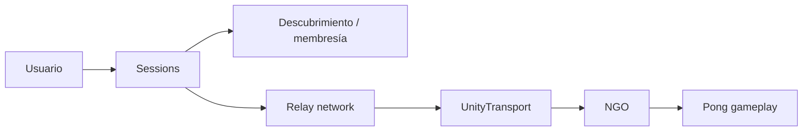

## Apuntes de referencia completos

**Módulo:** Programación en red e Inteligencia Artificial  
**Curso de Especialización:** Desarrollo de Videojuegos y Realidad Virtual
**Baseline técnico:** Unity `6000.3.13f1` · Netcode for GameObjects `2.7.0` · Unity Transport `2.6.0` · Multiplayer Services `2.2.1` · Authentication `3.6.1` · uGUI `2.0.0` · Unity Version Control (UVCS)

> **Nota de versión:** Multiplayer Services evoluciona con rapidez. Los nombres exactos de propiedades, tipos y overloads deben comprobarse siempre contra la versión realmente instalada en el proyecto antes de copiar código de referencia.

---

# Cómo utilizar estos apuntes

Estos apuntes son el **documento de referencia completo** de U06.

La unidad no vuelve a enseñar desde cero cómo sincronizar gameplay con NGO. Parte de un Pong de red ya funcional y añade las capas necesarias para convertir una conexión directa en una experiencia online coordinada mediante servicios.

La separación principal es:

```text
gameplay networking
≠
descubrimiento / membresía / conectividad online
```

Arquitectura conceptual:

```text
Sessions
→ coordina grupo, metadatos y lifecycle

Relay
→ facilita conectividad a través de Internet

NGO
→ sincroniza el gameplay

Pong
→ contiene reglas, simulación y estado del juego
```

Principio central:

> **La integración online no debe reescribir la lógica del Pong.**

---

# BLOQUE I — Arquitectura de una partida online

## 1. Del multijugador directo a una partida online

Un juego ya puede funcionar con:

```text
Host
+
Client
+
IP / puerto
+
NGO
```

pero esto no resuelve automáticamente:

- descubrimiento de partidas;
- invitaciones mediante código;
- listado de sesiones;
- metadatos;
- membresía;
- conectividad a través de NAT/firewall;
- cierre coordinado;
- estados online;
- errores de servicio.

Por eso una arquitectura online añade servicios alrededor del gameplay.

---

## 2. Capas del sistema



Cada capa responde preguntas diferentes.

### Sessions

Responde:

```text
¿qué partida existe?
¿quién pertenece?
¿cómo se descubre?
¿cómo se une alguien?
¿qué metadatos tiene?
¿cuándo se cierra?
```

### Relay

Responde:

```text
¿cómo se conectan los participantes por Internet
sin depender de una conexión entrante directa al host?
```

### NGO

Responde:

```text
¿cómo se sincronizan RPC, NetworkVariables y NetworkObjects?
```

### Gameplay

Responde:

```text
¿cómo se mueve una pala?
¿cómo se mueve la pelota?
¿quién marca?
¿cuándo termina una ronda?
```

---

## 3. Invariante de arquitectura

El mismo Pong debe poder mantenerse separado de la infraestructura online.

```text
modo directo/local
o
modo online mediante Session + Relay
```

La lógica de:

- movimiento;
- colisiones;
- score;
- round reset;
- autoridad del servidor;

no debería reescribirse solo porque se use Relay.

---

## 4. Flujo completo de la unidad

```text
inicializar servicios
→ autenticar
→ crear sesión
→ publicar / listar
→ unir
→ configurar Relay
→ iniciar NGO
→ jugar
→ gestionar participantes
→ salir / cerrar
```

El objetivo de U06 es comprender y demostrar ese flujo completo.

---

# BLOQUE II — Servicios, autenticación y creación de sesión

## 5. Inicialización de Unity Services

Patrón conceptual:

```text
UnityServices.InitializeAsync()
→ Authentication
→ Multiplayer Services
```

La inicialización debe:

- ser observable;
- registrar errores;
- actualizar la UI;
- evitar llamadas posteriores si el servicio no está listo.

Estados de UI posibles:

```text
Offline
Initializing
SignedIn
Creating
SessionCreated
Querying
Joining
Joined
Leaving
Error
```

---

## 6. Autenticación anónima

La autenticación anónima es adecuada para la práctica porque:

- reduce fricción;
- no necesita cuentas manuales;
- permite obtener una identidad de servicio;
- facilita probar Sessions.

Pero debe entenderse su límite:

> **una identidad anónima de laboratorio no equivale necesariamente a una identidad permanente de producción recuperable entre dispositivos o reinstalaciones.**

Para un producto real podrían utilizarse proveedores vinculados o estrategias de persistencia de identidad.

En la UT, la autenticación anónima es infraestructura, no el objetivo principal.

---

## 7. Tres identidades distintas

Pueden coexistir:

```text
Authentication player id
Session participant
NGO clientId
```

No se deben asumir iguales.

Ejemplo:

```text
Authentication
→ identifica usuario ante servicios

Session
→ identifica miembro de la sesión

NGO clientId
→ identifica conexión de red
```

Si hay que mapearlos, el contrato debe documentarse.

---

## 8. Crear una sesión

API conceptual de referencia:

```csharp
using Unity.Services.Multiplayer;

var options =
    new SessionOptions
    {
        MaxPlayers = 2
    }
    .WithRelayNetwork();

ISession session =
    await MultiplayerService.Instance
        .CreateSessionAsync(options);
```

Aspectos importantes:

- `MaxPlayers = 2` incluye al host;
- la sesión representa el grupo/lifecycle;
- Relay puede asociarse mediante la configuración de red;
- el código de sesión puede utilizarse para invitar.

> Los nombres exactos de miembros deben comprobarse con `com.unity.services.multiplayer` realmente instalado.

---

## 9. Join code y session ID

Una sesión puede tener diferentes identificadores.

### Join code

Pensado para invitación humana.

```text
session.Code
```

No es:

- IP;
- puerto;
- `clientId`;
- necesariamente el `session.Id`.

### Session ID

Identificador interno de la sesión.

Puede utilizarse para:

- referencia;
- listado;
- join desde browser;
- lifecycle.

---

# BLOQUE III — Publicación, descubrimiento y unión

## 10. Publicar una partida

Publicar no significa exponer información privada.

Significa permitir que una sesión sea descubrible según sus reglas.

Metadatos útiles:

```text
nombre
modo
versión
estado
mapa
plazas
```

Evitar:

- tokens;
- secretos;
- credenciales;
- datos personales innecesarios.

---

## 11. Consultar sesiones

Flujo conceptual:

```text
host crea sesión pública
→ publica metadatos
→ cliente consulta sesiones
→ UI representa resultados
```

API de referencia:

```csharp
var result =
    await MultiplayerService.Instance
        .QuerySessionsAsync(queryOptions);
```

El nombre exacto de las propiedades del resultado debe verificarse con la versión instalada.

---

## 12. Filtros de compatibilidad

Una lista útil no necesita mostrar “todo”.

Ejemplos:

```text
game = pong
build = ut06
map = default
plazas > 0
```

Objetivo:

> encontrar partidas compatibles.

Un filtro ayuda a evitar que clientes con versiones incompatibles intenten unirse.

---

## 13. Join por código

Conceptualmente:

```csharp
ISession session =
    await MultiplayerService.Instance
        .JoinSessionByCodeAsync(joinCode);
```

Casos de error:

- código inválido;
- sesión no encontrada;
- sesión llena;
- sesión cerrada;
- usuario no autorizado;
- servicio no disponible;
- fallo de inicio de red.

---

## 14. Join por listado

Flujo:

```text
QuerySessionsAsync
→ seleccionar resultado
→ Join por session id
```

El browser debe mostrar solo información relevante.

Ejemplo:

```text
Pong de Ana — 1/2
Pong de Luis — 1/2
```

No es necesario desarrollar un sistema completo de matchmaking.

---

## 15. Excepciones

Patrón de referencia:

```csharp
try
{
    // operación de session
}
catch (SessionException e)
{
    Debug.LogError(e);
}
```

La UI puede mostrar un mensaje amigable, pero no debería ocultar la excepción técnica.

Incorrecto:

```text
"Algo salió mal"
```

sin log ni contexto.

Mejor:

```text
status = "Error: session full"
+
log técnico de SessionException
```

---

# BLOQUE IV — Relay, transporte y NGO

## 16. Qué resuelve Relay

Sin Relay:

```text
cliente
→ necesita alcanzar al host
```

Con Relay:

```text
Host
→ endpoint público Relay

Client
→ endpoint público Relay
```

Relay facilita conectividad cuando NAT/firewall dificultan una conexión entrante directa.

La UT no necesita convertirse en una unidad profunda de NAT. Basta comprender la razón práctica.

---

## 17. Relay no sustituye NGO

Flujo:

```text
Pong RPC / NetworkVariable
→ NGO
→ UnityTransport
→ Relay
→ otro participante
```

Relay transporta tráfico.

NGO sigue gestionando:

- RPC;
- NetworkVariables;
- NetworkObjects;
- conexiones de gameplay.

---

## 18. Sessions + Relay

Patrón conceptual:

```text
Create/Join Session
→ Session network
→ Relay
→ NGO conectado
```

Con `WithRelayNetwork()` no es necesario duplicar manualmente el mismo lifecycle con una allocation de Relay independiente para el flujo básico de la unidad.

Objetivo:

```text
Session lifecycle
+
Relay network
coordinados
```

---

## 19. Direct vs Relay

### Direct fallback

Ejemplo:

```csharp
transport.SetConnectionData(
    "127.0.0.1",
    7777
);

NetworkManager.Singleton.StartClient();
```

### Online

```text
Session + Relay
```

No mezclar:

```text
WithRelayNetwork()
+
SetConnectionData(127.0.0.1)
```

como si fueran dos pasos del mismo modo.

Son **rutas de transporte diferentes**.

---

## 20. Pong autoritativo

El starter utiliza un `PongNetworkMatch`.

Flujo:

```text
input local
→ RPC
→ servidor
→ simulación
→ NetworkVariables
→ Host y Client representan
```

El servidor decide:

- posiciones de palas;
- posición de pelota;
- colisiones;
- score;
- reset de ronda.

Sessions y Relay no cambian esa autoridad.

---

# BLOQUE V — Participantes, datos y lifecycle

## 21. Datos de participante

Ejemplos:

```text
displayName
ready
```

Pregunta de arquitectura:

> ¿Debe este dato existir antes de conectar NGO?

Si sí, probablemente encaja en Session.

Pregunta:

> ¿afecta al gameplay frame a frame?

Si sí, probablemente pertenece a NGO.

Pregunta:

> ¿solo es una preferencia visual local?

Entonces quizá pertenece únicamente a UI/local.

---

## 22. Ready

Un dato `ready` puede coordinar:

```text
Host ready
Client ready
→ comenzar
```

La UT no exige implementar un sistema de ready complejo.

Lo importante es comprender:

- dónde vive el dato;
- quién puede escribirlo;
- quién lo observa;
- qué efecto tiene.

---

## 23. Lifecycle de sesión

Modelo:

```text
create / join
→ connected
→ playing
→ leave
→ close / cleanup
```

Cada transición debe dejar:

- UI coherente;
- referencias válidas;
- red detenida cuando proceda;
- sesión abandonada correctamente;
- estado preparado para volver al menú.

---

## 24. Salir

API conceptual:

```csharp
await session.LeaveAsync();
```

Flujo:

```text
leave session
→ desmontar network asociado
→ limpiar UI
→ volver a menú
```

No basta con:

```text
NetworkManager.Shutdown()
```

si el jugador sigue perteneciendo a una Session.

---

## 25. Host y cierre

En una arquitectura cliente-hosted, el host es especial.

Hay que documentar:

- qué ocurre si sale el Host;
- qué ocurre con los demás;
- si la sesión permanece;
- qué estado de UI queda;
- si existe o no host migration.

**Host migration no es requisito del núcleo de U06.**

---

## 26. Separar participant lifecycle y gameplay lifecycle

Session puede conocer:

```text
jugadores
membresía
ready
displayName
```

NGO puede conocer:

```text
conexión
clientId
objetos de red
RPC
NetworkVariables
```

Pong conoce:

```text
score
pelota
palas
ronda
```

Mezclar estas responsabilidades dificulta el diagnóstico.

---

# BLOQUE VI — UI de estado, errores y observabilidad

## 27. La UI debe mostrar estado real

Una UI online debe reflejar lo que está ocurriendo.

Estados útiles:

```text
Offline
Initializing
SignedIn
Creating
SessionCreated
Querying
Joining
Joined
Leaving
Error
```

Evitar:

```text
Loading...
```

que nunca cambia aunque la operación haya fallado.

---

## 28. Errores previsibles

Casos:

```text
invalid code
not found
full
closed
unauthorized
service unavailable
network start failed
```

Cada error debería producir:

- mensaje visible;
- log técnico;
- capa probable;
- posibilidad de repetir o volver a un estado seguro.

---

## 29. Observabilidad mínima

Registrar:

- inicialización de servicios;
- `playerId` cuando sea apropiado para diagnóstico;
- create session;
- session id/code cuando proceda;
- query;
- join;
- network state;
- NGO connected clients;
- disconnect;
- leave;
- fallback activado.

Nunca registrar:

- secretos;
- tokens;
- credenciales.

---

# BLOQUE VII — Troubleshooting por capas y fallback

## 30. Método de diagnóstico

```text
síntoma
→ capa
→ hipótesis
→ prueba mínima
→ observación
→ corrección
```

No empezar modificando Pong si el problema está en Sessions.

---

## 31. Capas de diagnóstico

### Capa 1 — Project / Services

Comprobar:

- proyecto vinculado;
- environment;
- Dashboard;
- disponibilidad de servicio.

### Capa 2 — Authentication

Comprobar:

- inicialización;
- signed in;
- player id;
- excepciones.

### Capa 3 — Sessions

Comprobar:

- create;
- query;
- join;
- visibility;
- capacity.

### Capa 4 — Relay / network

Comprobar:

- network de la session;
- estado;
- transport;
- start failure.

### Capa 5 — NGO

Comprobar:

- listening;
- clientes conectados;
- disconnect reason;
- RPC.

### Capa 6 — Pong

Comprobar:

- input;
- simulación;
- NetworkVariables;
- score.

---

## 32. Ejemplo de diagnóstico

Síntoma:

```text
Client ve la sesión pero no entra al Pong
```

Hipótesis A:

```text
Join falló
```

Prueba:

```text
¿la operación de Join devuelve una Session válida?
```

Si sí, pasar a la siguiente capa.

Hipótesis B:

```text
el network de la Session no ha arrancado
```

Prueba:

```text
inspeccionar/loguear estado del network
```

No modificar el Pong antes de comprobar estas capas.

---

## 33. Fallback local

El starter conserva:

```text
Local Host
Local Client
Local Stop
```

Sirve para responder:

> ¿falla la infraestructura cloud o falla el gameplay?

Si:

```text
Pong directo funciona
+
online falla
```

la investigación debe centrarse en:

```text
Services
Authentication
Session
Relay
```

antes que en el gameplay.

---

## 34. Fallback no significa ocultar el fallo

Procedimiento correcto:

```text
1. registrar error
2. identificar capa
3. ofrecer direct/local
4. continuar verificando Pong
5. documentar que online NO está validado
```

No es válido:

```text
"Como local funciona, online también"
```

---

## 35. Cloud no disponible

Una evidencia válida puede ser:

```text
error del servicio documentado
+
Pong directo funcional
+
capa e hipótesis identificadas
```

No basta:

```text
"no iba Internet"
```

sin trazabilidad.

---

# BLOQUE VIII — Realismo profesional, seguridad y alcance

## 36. Metadatos y privacidad

Los metadatos de Session deben contener solo lo necesario.

Adecuado:

```text
game = pong
build = ut06
map = default
status = waiting
```

Evitar:

- correo;
- nombre real innecesario;
- tokens;
- claves;
- datos sensibles.

---

## 37. Identidad de producción

La autenticación anónima de la práctica permite trabajar con Sessions, pero un producto real puede necesitar:

- identidad persistente;
- recuperación de cuenta;
- proveedores externos;
- vinculación de identidades;
- políticas de privacidad.

Estas necesidades quedan fuera del núcleo de la UT.

---

## 38. No convertir U06 en matchmaking avanzado

Fuera del núcleo:

- skill matchmaking;
- ranking;
- matchmaking queues complejas;
- host migration completa;
- reconexión avanzada;
- dedicated servers;
- backfill;
- cross-region optimization;
- seguridad backend avanzada.

La unidad busca comprender el flujo online fundamental.

---

# ANEXO A — UVCS y recovery

## 39. Checkpoints

```text
UT06-START
UT06-S81 · Online architecture
UT06-S82 · Session created
UT06-S83 · Session browser
UT06-S84 · Join flow
UT06-S85 · Pong over Relay
UT06-S86 · Participant lifecycle
UT06-S87 · Online troubleshooting
UT06-FINAL · Pong Online validated
```

Labels recomendadas:

```text
UT06-START
UT06-RECOVERY-DIRECT
UT06-RECOVERY-S85
UT06-FINAL-VALIDATED
```

---

## 40. Recovery points

### `UT06-RECOVERY-DIRECT`

Debe garantizar:

```text
Pong NGO directo funcional
```

aunque UGS no esté disponible.

### `UT06-RECOVERY-S85`

Debe garantizar:

```text
Create
Join
Relay
Pong online
```

antes de participant data y troubleshooting.

---

## 41. Qué versionar

Sí:

- `Assets`;
- `Packages`;
- `ProjectSettings`;
- scripts;
- escena;
- UI;
- documentación;
- `.meta`.

No:

- `Library`;
- `Temp`;
- `Logs`;
- `UserSettings`;
- credenciales;
- tokens;
- workspace UVCS personal.

---

# ANEXO B — Glosario

**Session**  
Abstracción que coordina grupo de jugadores, datos, discovery y lifecycle.

**Relay**  
Servicio que permite transportar tráfico entre participantes mediante infraestructura intermedia accesible públicamente.

**NGO**  
Netcode for GameObjects; sistema de sincronización de gameplay.

**Unity Transport**  
Capa de transporte utilizada por NGO.

**Join code**  
Código humano para invitar a una sesión.

**Session ID**  
Identificador interno de una Session.

**Participant data**  
Datos asociados a miembros de la Session.

**Authentication player id**  
Identidad utilizada por Unity Authentication.

**NGO clientId**  
Identificador de una conexión de NGO.

**Fallback**  
Ruta alternativa que permite continuar diagnosticando o probando una parte del sistema.

**Lifecycle**  
Secuencia de estados desde creación/unión hasta salida/cierre.

---

# ANEXO C — Autoevaluación

1. ¿Qué diferencia hay entre Sessions y NGO?
2. ¿Qué problema resuelve Relay?
3. ¿Por qué Relay no sustituye NGO?
4. ¿Qué significa que el Pong siga siendo autoritativo?
5. ¿Qué diferencia hay entre Authentication player id, Session participant y NGO clientId?
6. ¿Qué es un join code?
7. ¿Qué diferencia hay entre join code y session ID?
8. ¿Qué metadatos publicarías?
9. ¿Qué datos no publicarías?
10. ¿Qué estados debería mostrar la UI?
11. ¿Por qué `NetworkManager.Shutdown()` puede ser insuficiente para salir del modo online?
12. ¿Qué ocurre conceptualmente al salir el Host?
13. ¿Qué dato pondrías en Session y cuál en NGO?
14. ¿Qué capa revisarías si Query devuelve vacío?
15. ¿Qué capa revisarías si la sesión existe pero NGO no conecta?
16. ¿Qué capa revisarías si NGO conecta pero Pong no se mueve?
17. ¿Para qué sirve el fallback local?
18. ¿Por qué fallback no significa ocultar una incidencia?
19. ¿Qué limitación tiene la autenticación anónima como modelo de producción?
20. ¿Qué demuestra UVCS en esta UT?

---

# Criterio de cierre de U06

Al finalizar debes poder demostrar:

```text
Create
→ Browse / Code
→ Join
→ Relay
→ Pong
→ Participant data
→ Leave
→ Troubleshooting
→ Fallback
```

y explicar qué parte pertenece a:

```text
Authentication
Sessions
Relay
NGO
gameplay
```
